## 第3章 基于sMTJ的伊辛求解仿真框架与性能评估

本章评估第二章封装的sMTJ概率单元在组合优化任务中的求解能力，目标是回答同一物理阵列承担伊辛求解时，全自旋三位一体架构在算法、器件与硬件三层上的可达性能与边界。在伊辛语境下，sMTJ直接担任自旋，其Sigmoid翻转概率对应玻尔兹曼分布下的单自旋条件采样，器件本征行为因而会直接进入算法层结果。

本章建立从问题编码到性能投影的仿真评估链路：3.1节把Max-Cut、旅行商问题与整数分解统一归约为$(J,h)$接口下的伊辛哈密顿量最小化，使各类异构问题在求解器入口处共享同一对象；3.2节以5节点Max-Cut示例展示问题、编码、采样、退火与解码的物理流程；3.3节在G-set、TSPLIB与半素数三组公共基准上评估理想sMTJ-Gibbs动力学的求解能力、与经典Metropolis-SA之间的算法层差异以及在约束密集QUBO上的结构性边界；3.4节将第二章的五参数行为模型接入求解器，给出器件非理想性的灵敏度排序，并把算法层成功概率投影至sMTJ阵列、CMOS p-bit ASIC、FPGA SBM与CPU四类电学Ising硬件之上作时间与能耗对比；3.5节把单自旋更新链落实为sky130晶体管级电路，实测写链传输特性、更新能量与共享写线IR压降，将这些电路约束回灌到消融框架并据此修正硬件投影；3.6节归纳本章对主线的贡献以及向第四章PBNN任务传递的方法学约束。

### 3.1 组合优化问题的伊辛形式化

组合优化问题的伊辛形式化是抽象问题与物理求解器之间的接口层。本节先给出伊辛模型作为组合优化求解器的统计物理基础，再把Max-Cut、旅行商、整数分解以及其它典型NP-hard问题统一翻译为伊辛哈密顿量
$$
H(\mathbf{s})=-\sum_{i<j}J_{ij}s_is_j-\sum_ih_is_i,\quad s_i\in\{-1,+1\}
$$
的最小化问题，使后续求解器在接口上仅面对耦合矩阵$J$与外场向量$h$两个对象。

#### 3.1.1 伊辛模型作为组合优化求解器的理论基础

伊辛模型源自统计物理对铁磁相变的描述，其哈密顿量在给定耦合矩阵$J$与外场$h$后定义了关于自旋构型$\mathbf{s}$的能量函数。处于温度$T$的热浴中时，系统取任一构型的概率服从玻尔兹曼分布
$$
p(\mathbf{s})=\frac{1}{Z}\exp[-\beta H(\mathbf{s})],\qquad Z=\sum_{\mathbf{s}}\exp[-\beta H(\mathbf{s})]
$$
其中$\beta=1/(k_BT)$为逆温度，$Z$为配分函数。当$\beta\to\infty$即温度趋于零时，分布的概率质量集中于使$H$取最小值的基态构型$\mathbf{s}^*$上。若一个组合优化问题被映射为伊辛哈密顿量且保证最优解对应基态，则原优化问题即归结为在低温极限下寻找玻尔兹曼分布的众数。所有伊辛求解器都建立在这一工作逻辑之上。

一般含任意符号耦合的伊辛自旋玻璃基态求解为NP-hard[^Barahona1982]：哈密顿能量在高维离散空间$\{-1,+1\}^N$上呈高度非凸景观，存在指数多的局部极小。若直接在零温极限下进行贪婪下降，系统常被局部极小所俘获而无法达到全局最优。Kirkpatrick等提出的模拟退火算法 (simulated annealing，SA) [^Kirkpatrick1983]令系统在较高温度下充分遍历构型空间以跨越能量势垒，再以适当速率降低温度并持续采样，最终在低温极限下逼近基态。模拟退火理论进一步表明，冷却调度足够慢且与能垒深度匹配时，马尔可夫链可依概率收敛至全局最优；典型充分形式为温度按$T(t)\propto 1/\log t$衰减[^Hajek1988]。实际工程中为兼顾解质量与求解时间，更常用几何或线性退火。本章将SA作为求解器内核的算法基础，并将其sMTJ物理实现 (即p-bit SA) 作为后续基准的核心评估对象。

在实现层面，玻尔兹曼分布的采样可通过马尔可夫链蒙特卡罗方法的单自旋更新获得。任一自旋$s_i$在给定其它自旋$\mathbf{s}_{\neq i}$时的条件概率仅依赖于该自旋所处的有效局部场
$$
h_i^{\mathrm{eff}}=\sum_{j\neq i}J_{ij}s_j+h_i
$$
具体形式为
$$
p(s_i=+1\mid\mathbf{s}_{\neq i})=\frac{1}{1+\exp(-2\beta h_i^{\mathrm{eff}})}=\sigma(2\beta h_i^{\mathrm{eff}})
$$
其中$\sigma(\cdot)$为sigmoid函数。该条件概率在形式上与双稳态随机器件在外部偏置与热扰动共同作用下的占据概率分布一致。正因如此，sMTJ得以直接充当伊辛自旋，在硬件层面实现玻尔兹曼采样。

#### 3.1.2 伊辛哈密顿量与QUBO的等价变换

许多文献以二次无约束二值优化 (quadratic unconstrained binary optimization，QUBO) 形式给出映射[^Kochenberger2014]：
$$
f(\mathbf{x})=\mathbf{x}^{\top}Q\mathbf{x},\quad x_i\in\{0,1\}
$$
其中$Q$为对称矩阵。通过线性变换$s_i=2x_i-1$可将伊辛模型与QUBO相互转化。将$s_is_j=4x_ix_j-2x_i-2x_j+1$以及$s_i=2x_i-1$代入伊辛哈密顿量并整理，可得
$$
H(\mathbf{s})=-4\sum_{i<j}J_{ij}x_ix_j+2\sum_i\!\left(\sum_{j\neq i}J_{ij}-h_i\right)\!x_i+C
$$
其中常数$C=-\sum_{i<j}J_{ij}+\sum_ih_i$不影响最小化。对照QUBO定义可读出
$$
Q_{ij}=-4J_{ij}\ (i<j),\qquad Q_{ii}=2\!\left(\sum_{j\neq i}J_{ij}-h_i\right)
$$
反之，给定QUBO参数时取$s_i=2x_i-1$即可读回等价的伊辛参数。两种形式在多项式时间内可无损互换，最优解也一一对应。本章后续一律采用伊辛形式描述，与以QUBO形式发布的基准实例或算法实现对接时只需按上式完成系数重映射。该转换在仿真框架中被实现为`problems.qubo_to_ising(Q)`，取$J=-Q_{\text{off}}/4$与$h_i=-Q_{\text{off}}\mathbf{1}/4-Q_{ii}/2$，其中$Q_{\text{off}}$表示$Q$剥离对角后的部分。所有QUBO形式的问题 (TSP、因子分解等) 均先在各自问题模块中装配$Q$矩阵，统一经该转换函数进入求解器。

#### 3.1.3 Max-Cut问题的伊辛映射

Max-Cut的判定形式为NP-complete，优化形式为NP-hard[^Karp1972]。作为加权无向图划分问题，它给定$G=(V,E,w)$，要求寻找将顶点集$V$划分为两部分$(S,\bar S)$的方案，使被切断的边权和最大。
$$
\mathrm{cut}(S)=\sum_{(i,j)\in E,\,i\in S,\,j\in\bar S}w_{ij}
$$
设自旋$s_i=+1$表示$i\in S$、$s_i=-1$表示$i\in\bar S$，则$i,j$分属两侧时$s_is_j=-1$、同侧时$s_is_j=+1$。于是
$$
\mathrm{cut}(S)=\frac{1}{2}\sum_{(i,j)\in E}w_{ij}(1-s_is_j)=\frac{W}{2}-\frac{1}{2}\sum_{(i,j)\in E}w_{ij}s_is_j
$$
其中$W=\sum_{(i,j)\in E}w_{ij}$。最大化切割等价于最小化
$$
H(\mathbf{s})=-\sum_{i<j}J_{ij}s_is_j,\qquad J_{ij}=\begin{cases}-w_{ij}/2,&(i,j)\in E\\0,&\text{其它}\end{cases}
$$
该映射适合作为伊辛机基准：$J$的稀疏模式与原图邻接矩阵一致，问题规模$|V|$即为自旋数，不引入任何辅助变量；同时它不含约束惩罚项，全体自旋构型都是可行解，求解器不会因惩罚权重选取不当而陷入不可行区。Goemans和Williamson基于半定规划给出的$0.87856$近似比保证，为启发式求解器的解质量提供了经典参照[^Goemans1995]。由Ye整理并发布于Stanford公开站点的G-set基准集是Max-Cut求解器文献中的标准实例集，本章用作Max-Cut性能评估基准。

#### 3.1.4 旅行商问题的伊辛映射

对含$n$个城市的对称旅行商问题 (traveling salesman problem，TSP)，采用$n\times n$二值编码：变量$x_{v,j}\in\{0,1\}$表示城市$v$是否位于巡游的第$j$个位置。合法的巡游需满足每个城市恰被访问一次、以及每个位置恰含一个城市，这在伊辛形式下以惩罚项表示[^Lucas2014]：
$$
H_{\mathrm{const}}=A\sum_{v}\!\left(1-\sum_{j}x_{v,j}\right)^{\!2}+A\sum_{j}\!\left(1-\sum_{v}x_{v,j}\right)^{\!2}
$$
路径长度项为
$$
H_{\mathrm{cost}}=B\sum_{(u,v)\in E}d_{uv}\sum_{j=1}^{n}x_{u,j}x_{v,j+1}
$$
其中下标$j$按模$n$循环，$d_{uv}$为城市间距离。完整哈密顿量为$H=H_{\mathrm{const}}+H_{\mathrm{cost}}$，经$x_i=(1+s_i)/2$代换即化为伊辛形式。

惩罚系数$A,B$的选取直接关系到基态是否对应合法路径。当$A>B\cdot\max_{u,v}d_{uv}$时，任何违反约束带来的能量上升都超过路径代价可能的最大下降，从而保证基态解的可行性。该映射将原本$n$城市的问题放大到$n^2$个自旋，耦合矩阵呈块结构：城市块内部完全耦合以执行单城约束，位置块内部亦然；跨块耦合由距离矩阵填充。规模放大与耦合密集是TSP被用作求解器压力测试的主要原因。

可行性条件$A>Bd_{\max}$给出的是基态保证，并未说明退火过程中可行域的可达性。在仿真框架的`problems.build_tsp_problem`实现中，惩罚系数采用参数化形式`A = A_margin * B * dmax`，`A_margin`由调用方显式给定。本章主基准取$A\text{-margin}=2.0$ (惩罚是距离最大值的两倍)。但后续基准节的实测显示，该取值下`ulysses16`等实例的单次试验可行率仅$3\%$，远低于由基态可行性条件直接外推的预期。这说明基态可行性条件并不足以保证退火过程中可行域的可达性，其机理留待后续基准节结合实测数据与能量轨迹展开。考虑到这一点，本框架在问题装配接口上把$A\text{-margin}$设为显式超参数，不再固定为常数，从而为系统扫描留出接口[^process-tsp-param]：

```python
def build_tsp_problem(D, B=1.0, A_margin=2.0, name=None):
    n = D.shape[0]
    A = A_margin * B * float(D.max())  # penalty strength
    # ... assemble Q via row/column constraint and cost terms ...
    return Problem(name=name, n=n * n, J=J, h=h,
                   meta={"D": D, "n_cities": n, "A": A, "B": B})
```

这一参数化在后续TSP基准的消融实验中被直接使用，扫描$A\text{-margin}\in\{1.2, 1.5, 2.0, 3.0, 5.0, 10.0\}$。

[^process-tsp-param]: 过程记录：最初固定$A\text{-margin}=2.0$只是为了满足基态可行性留出安全余量；主基准出现`ulysses16`可行率仅$3\%$、$p_s=0$后，才将该系数暴露为显式超参数并加入扫描。后续$A\text{-margin}=1.2\sim 10$的结果显示可行率仍仅$2\%\sim 3\%$，说明问题不只是惩罚项偏小。

#### 3.1.5 整数分解的伊辛映射

给定合数$M$，寻找正整数$p,q$使$M=pq$的问题在密码学与随机计算基准中具有重要背景。将$p,q$按二进制展开为位变量$p_i,q_j\in\{0,1\}$，则$M=pq$按位展开为一系列按位乘法与进位约束：
$$
\sum_{i+j=k}p_iq_j+\sum_{\ell}c_{\ell,k}=M_k+2\sum_{\ell}c_{\ell,k+1}
$$
其中$c_{\ell,k}$为进位辅助变量，$M_k$为$M$的第$k$位。整体哈密顿量取为所有按位约束残差的平方和[^Jiang2018]：
$$
H=\sum_{k}\!\left(\sum_{i+j=k}p_iq_j+\sum_{\ell}c_{\ell,k}-M_k-2\sum_{\ell}c_{\ell,k+1}\right)^{\!2}
$$
展开后含高阶多体相互作用项，可通过引入辅助变量降为两体，从而严格满足伊辛模型的两体耦合要求。

整数分解的映射不同于Max-Cut和TSP。它的自旋数量随$\log M$的平方增长，辅助进位变量的数量与原变量数量相当；耦合结构非对称而局部密集，拓扑形态直接反映乘法电路的连线。Borders等在2019年基于sMTJ的p-bit阵列，对小规模半素数分解完成了硬件实验验证[^Borders2019]，本章把整数分解列为基准实例，正是出于这一考虑。

上述映射留有一个关键自由度：$p$与$q$各自分配的位宽$(b_p, b_q)$。理论上只要$2^{b_p}\cdot 2^{b_q}$的乘积空间覆盖真实因子对即可，但实际求解性能对该自由度高度敏感。以$M=51=3\times 17$为例：若$b_q=4$则$\hat q\in\{1, 3, \dots, 15\}$不含$17$，**无论退火多长都不可能命中真解**；若$b_q$取过大值 (如$b_q=7$)，可表达集合膨胀至$\{1, 3, \dots, 127\}$，真实最优点$\hat q=17$在允许集合中的相对密度被稀释，随机初始化落入正确吸引盆地的先验概率降低。后续因子分解基准的消融实验将定量展示这两种失效模式。仿真框架中，`problems.build_factoring_problem`对此采用**最小覆盖分配**策略作为缺省：对已知的$M$通过$O(\sqrt M)$试除法找到真实因子$(p, q)$，取$b_p=\lceil\log_2(p+1)\rceil$、$b_q=\lceil\log_2(q+1)\rceil$，恰好覆盖真因子：

```python
def suggest_factoring_bp_bq(M):
    """Trial-division to locate the smaller factor, then minimal
    bit-coverage on each side."""
    for p in range(3, int(np.sqrt(M)) + 1, 2):
        if M % p == 0:
            q = M // p
            return (int(np.ceil(np.log2(p + 1))),
                    int(np.ceil(np.log2(q + 1))))
    raise ValueError(f"{M} is prime or has no small factor")
```

这一做法使不同$M$实例间的$N_{\text{spin}}$规模紧凑可比，且与实际因子的不平衡度无关。若要模拟实际盲分解场景、显式指定较大的$(b_p, b_q)$，可通过关键字参数覆盖默认策略，相应的性能退化将在后续因子分解基准中量化。这里也暴露出一个方法学问题：编码层的参数选取位于评估流水线的上游，它对下游算法性能的影响并不小于退火调度的调参。

#### 3.1.6 其它典型问题的映射综述

除上述三类问题外，3-SAT、图着色、最小顶点覆盖、背包、数分划、哈密顿回路等多类NP-hard问题均可按类似思路映射为伊辛形式，相关推导可参见前述综述。下表归纳这些问题在伊辛映射下的基本规模指标。

表3.1 典型组合优化问题的伊辛映射规模比较

| 问题 | 自旋数阶数 | 耦合稀疏性 | 惩罚项个数 |
|---|---|---|---|
| Max-Cut | $O(\lvert V\rvert)$ | 与原图一致 | 0 |
| 图$k$着色 | $O(k\lvert V\rvert)$ | 局部 | 2 |
| 最小顶点覆盖 | $O(\lvert V\rvert)$ | 与原图一致 | 1 |
| 3-SAT | $O(\lvert V\rvert+\lvert C\rvert)$ | 局部 | $O(\lvert C\rvert)$ |
| 0-1背包 | $O(n+\log W)$ | 密集 | 1 |
| 数分划 | $O(\lvert S\rvert)$ | 全连接 | 0 |
| TSP | $O(n^2)$ | 块密集 | 2 |
| 整数分解 | $O(\log^2 M)$ | 结构化 | $O(\log M)$ |

注：$\lvert V\rvert, \lvert E\rvert, \lvert C\rvert$分别表示图的顶点数、边数或子句数，$n, W$分别表示项目数与背包容量。该列表并不详尽，旨在说明上述映射方法覆盖面广。各类问题在接口上最终都归结为同一对$(J,h)$，差异仅出现在前端输入加载阶段。正因如此，本章的仿真框架可作为通用求解器使用，这也是将其设计为问题层与求解器解耦结构的初衷。

### 3.2 完整流程示例：5节点Max-Cut实例

要在机理层面看清伊辛形式化与求解器框架如何协同，最直接的办法是取一个足够小的实例逐环节展开。本节用一个仅含5个自旋的Max-Cut示例，把“问题→编码→采样→退火→解码”整条链路完整呈现。这一规模下$2^5=32$个自旋构型可被完整枚举，能量景观与退火轨迹也能逐步刻画，可为后续基准节的统计指标提供机理参照。

#### 3.2.1 问题与编码

取5节点无向图$G=(V, E)$，节点编号$0\sim 4$，边集为
$$
E=\{(0,1),(0,2),(1,3),(2,3),(2,4),(3,4)\},
$$
共$|E|=6$条边，权值统一取$w_{ij}=1$。该图含三角形$2-3-4$，因此最大切分严格小于$|E|$。按伊辛形式化中给出的Max-Cut映射$J_{ij}=-w_{ij}/2$、$h_i\equiv 0$，相应哈密顿量化为
$$
H(\mathbf{s})=-\sum_{i<j}J_{ij}s_is_j=\frac{1}{2}\sum_{(i,j)\in E}s_is_j,
$$
其中$s_i\in\{-1,+1\}$。$32$个自旋构型可全部枚举，能量取且仅取$\{-2,-1,0,+1,+3\}$五个层级，简并度依次为$4, 6, 12, 8, 2$，基态能量$E_{\min}=-2$对应切数$\mathrm{cut}=5$ (两侧划分$S=\{1,2\}$、$\bar S=\{0,3,4\}$或其$\pm$翻转对称版本)。最差构型为全$+1$或全$-1$，对应$\mathrm{cut}=0$、$E_{\max}=+3$。完整能量层级见图3.1(c)。

完整流程框架见图3.1(a)：左起依次为问题、伊辛编码、p-bit网络、退火调度与解码，每一阶段均对应仿真框架中可单独识别的接口层。

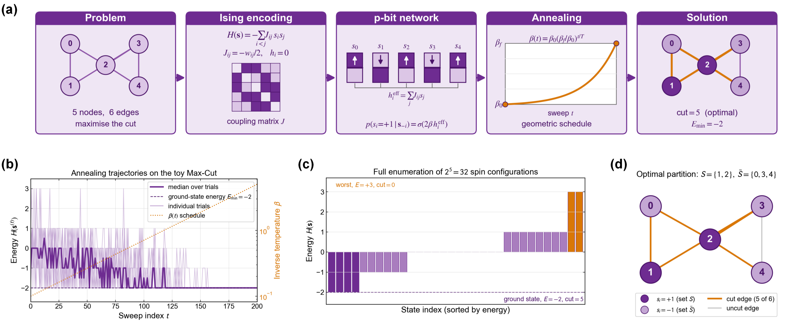

图3.1 5节点Max-Cut示例的完整流程图。(a) 问题编码、p-bit网络、退火调度与解码流程；(b) 异步Gibbs退火轨迹；(c) 32个自旋构型的能量枚举；(d) 最优图划分。

#### 3.2.2 sMTJ-Gibbs动力学的展开

将编码完成的$(J, h)$输入异步Gibbs采样器，每个扫描时刻按随机排列依次访问5个自旋，每次访问从条件分布
$$
p(s_i=+1\mid\mathbf{s}_{-i})=\sigma\bigl(2\beta\,h_i^{\mathrm{eff}}\bigr),\quad h_i^{\mathrm{eff}}=\sum_jJ_{ij}s_j,
$$
抽样新值。上式对应sMTJ作为p-bit的物理工作模式：$h_i^{\mathrm{eff}}$以电流偏置的形式施加于自由层，外部温度对应热涨落幅度$1/\beta$，新的自旋值由器件随机切换得到。退火调度采用几何衰减$\beta(t)=\beta_0(\beta_f/\beta_0)^{t/T}$，端点取$(\beta_0,\beta_f)=(0.1,5.0)$，扫数$T=200$；以独立master seed派生8次试验。图3.1(b)给出求解轨迹：浅紫细线为单次试验、深紫粗线为$8$次试验的中位轨迹、橙色虚线为退火端点对齐的$\beta(t)$参考。

退火过程在轨迹上分为两段，区分相当清晰。在前$\sim 50$个扫数 (对应$\beta\lesssim 1$，温度$T=1/\beta\gtrsim 1$) 轨迹在能量谱上充分混合，单次能量在$\{-2,-1,0,+1,+3\}$五个层级间频繁跳变，与玻尔兹曼分布$p(\mathbf{s})\propto e^{-\beta H(\mathbf{s})}$在高温下的近似均匀采样一致。$\beta$越过约$2$之后翻转概率$\sigma(2\beta h_i^{\mathrm{eff}})$被局部场的符号近乎决定性地拉向能量下降方向，单次试验的能量逐步沉入$E\leq-1$区间；至$t\sim 150$后所有试验的能量稳定在$E_{\min}=-2$。最终8次试验全部命中基态，相应单次成功概率$p_s=1$。在这一小规模能量景观上，基础异步Gibbs退火完整经历了高温遍历、低温凝固，并收敛至基态。3.3节大规模基准中$p_s<1$、$\mathrm{TTS}_{99}<\infty$的统计结果，可追溯到同一机制：能垒结构与扫数预算双重制约下出现的有限样本效应。

#### 3.2.3 解的几何含义

最终自旋构型解码为图分区。基态$\mathbf{s}^*=(-,+,+,-,-)$对应划分$S=\{1,2\}$、$\bar S=\{0,3,4\}$，其切边集为$\{(0,1),(0,2),(1,3),(2,3),(2,4)\}$五条；唯一未切的边$(3,4)$位于三角形$2-3-4$内部，对应该三角形在任何二分中至少必有的一条同色边。该5节点例子的最优性可由$2^5=32$个自旋构型枚举直接验证，Goemans-Williamson结果在这里仅作为Max-Cut算法背景。最优分区见图3.1(d)。

#### 3.2.4 与大规模基准的关系

上述5自旋实例与后续Max-Cut基准节的G-set实例 ($n=800\sim 2000$) 在仿真框架的接口层上完全同构：均通过`Problem(name, n, J, h)`实例化、由`SolverConfig`配置退火端点与扫数、由`multistart`派生独立试验。规模放大带来的差异落在状态空间而非流程上。从$2^5$增至$2^{2000}$后，能量景观的层级数与浅极小密度都按指数膨胀，单步异步Gibbs在固定扫数预算下已不足以遍历高温阶段所需的有效区域，$p_s$随之从$1$退化至$10^{-1}\sim 10^{-2}$量级。3.3节以$p_s$、$\mathrm{TTS}_{99}$与相对偏差三层指标刻画这一退化幅度；本节示例则提供规模扩展前的参照：在统计不确定性可忽略的实例上，伊辛求解器与几何退火的组合以接近$1$的概率收敛至基态。后续基准节关注的动力学差异、扫数预算、退火端点与编码瓶颈，均是该流程在更大规模能量景观下的延伸。

本节全部数据由附带的`toy_demo_maxcut5.py`脚本独立复现，该脚本仅依赖NumPy与Matplotlib，代码量约$200$行；框架图由`schematic_flow.py`生成。运行二者即可在本地复现本节四幅图的全部数值与图形结果。

### 3.3 基准测试与性能评估

本节在公共基准实例上对前述求解器与仿真框架进行系统性能评估，覆盖三类具有不同结构特征的组合优化问题：Max-Cut (稀疏/稠密图、无约束)、整数分解 (约束耦合、位乘法电路拓扑)、TSP ($n^2$-spin QUBO、双层约束-目标能量结构)。每类问题除主基准外，均设计相应的消融实验以分离超参数与算法机制的贡献；TSP节进一步给出改进路径的定量验证。

三小节共享统一的评估指标：单次试验成功概率$p_s$ (按问题语义定义的容差内命中最优解的比例)、$99\%$置信求解时间$\mathrm{TTS}_{99}=t_{\text{median}}\cdot\log(1-0.99)/\log(1-p_s)$、相对于已知最优解的最佳/中位相对偏差$\Delta_{\text{best}}, \Delta_{\text{med}}$。所有基准在Intel Core i9-14900HX (32核) 单节点上运行，多起点通过`multistart`接口的`SeedSequence.spawn`协议实现位级可复现并行[^wallclock]；每次试验的完整能量轨迹与最终自旋构型均持久化为JSON，以支持事后复核。$p_s$是$N_{\text{trial}}$次伯努利试验的命中比例，其区间按Wilson 95%给出；由$p_s$导出的$\mathrm{TTS}_{99}$比值的区间用命中数的参数化自举 (二项重采样$10^4$次) 传播，正文与表注引用的区间均由此计算。

[^wallclock]: 本章墙钟$\mathrm{TTS}_{99}$与单次耗时为该机器实测值 (由仓库`results_rerun/`下各驱动重新生成)，随宿主机性能近似线性缩放；而单次成功率$p_s$、以扫数计的$\mathrm{TTS}_{99}$比值、由$p_s$导出的加速比、以及器件消融的退化倍数均与硬件无关，可在任意环境逐位复现。

#### 3.3.1 Max-Cut基准

**基准设置。**

Max-Cut的伊辛形式化在组合优化问题的伊辛形式化段落已给出：$J_{ij}=-w_{ij}/2$、$h_i=0$，基态自旋构型给出最大切分$C=\tfrac{1}{2}\sum_{ij}w_{ij}-H(\mathbf{s})$。本节采用G-set基准[^Gset]，这是Max-Cut算法评测的标准数据集，由Stanford优化组维护，已成为该问题主流启发式与精确算法的公共比较平台。

选取三个互补实例作为代表：$\mathrm{G1}$ ($n=800$、$m=19176$条正权边、平均度约$48$) 为稠密均匀图；$\mathrm{G14}$ ($n=800$、$m=4694$条边、平均度约$12$、含负权边) 为稀疏符号混合图，用于测试困难景观下的求解表现；$\mathrm{G22}$ ($n=2000$、$m=19990$条边) 测试规模扩展性。所有实例的权值取$\{-1, +1\}$或$\{+1\}$，无权值缩放。

求解器配置：JIT编译的严格异步Gibbs抽样，几何退火$\beta(t)=\beta_0(\beta_f/\beta_0)^{t/T}$，端点$(\beta_0, \beta_f)=(0.1, 10.0)$，扫数$T=10000$。每个实例独立运行$N_{\text{trial}}=200$次，随机种子由`numpy.random.SeedSequence`派生，保证不同实例间及与其它章节的结果可复现。评估指标与整数分解节一致：单次成功概率$p_s$ ($p_s=1$指解码切分精确等于已公布最优已知解，BKS)、$99\%$置信求解时间$\mathrm{TTS}_{99}$、中位相对偏差$\Delta_{\text{med}}=(C_{\text{BKS}}-C_{\text{median}})/C_{\text{BKS}}$。BKS及后续BLS对照数据取自Benlic和Hao的汇总[^BenlicHao2013]。

**主基准结果。**

三个实例的汇总如下表。图3.2(a)至图3.2(c)展示切分值分布在BKS附近的聚集形态，图3.2(d)至图3.2(f)给出最好、中位、最差单次运行的切分值随扫数的演化。

表3.2 三个G-set实例的主基准结果

| 实例 | $n$ | $m$ | BKS | $C_{\text{best}}$ | $C_{\text{median}}$ | $\Delta_{\text{best}}$ | $\Delta_{\text{med}}$ | $p_s$ | $\mathrm{TTS}_{99}$(s) | 单次耗时(s) |
|---|---|---|---|---|---|---|---|---|---|---|
| $\mathrm{G1}$  | 800  | 19176 | 11624 | 11624 | 11624 | $0$    | $0$      | $0.685$ | $3.73$   | $0.93$ |
| $\mathrm{G14}$ | 800  | 4694  | 3064  | 3062  | 3054  | $0.065\%$ | $0.326\%$ | $0$     | $\infty$ | $0.55$ |
| $\mathrm{G22}$ | 2000 | 19990 | 13359 | 13359 | 13356 | $0$    | $0.022\%$  | $0.02$  | $335.6$  | $1.47$ |

注：每个实例$N_{\text{trial}}=200$次独立试验，$T=10000$扫数，$(\beta_0,\beta_f)=(0.1, 10.0)$，JIT编译的异步Gibbs更新。$\Delta_{\text{best}}$与$\Delta_{\text{med}}$为最佳与中位切分相对于BKS的相对偏差。表中各$p_s$的Wilson区间按3.3节开头的统计约定计算，逐行数值见仓库`eda/interface/ci_audit_summary.csv`。

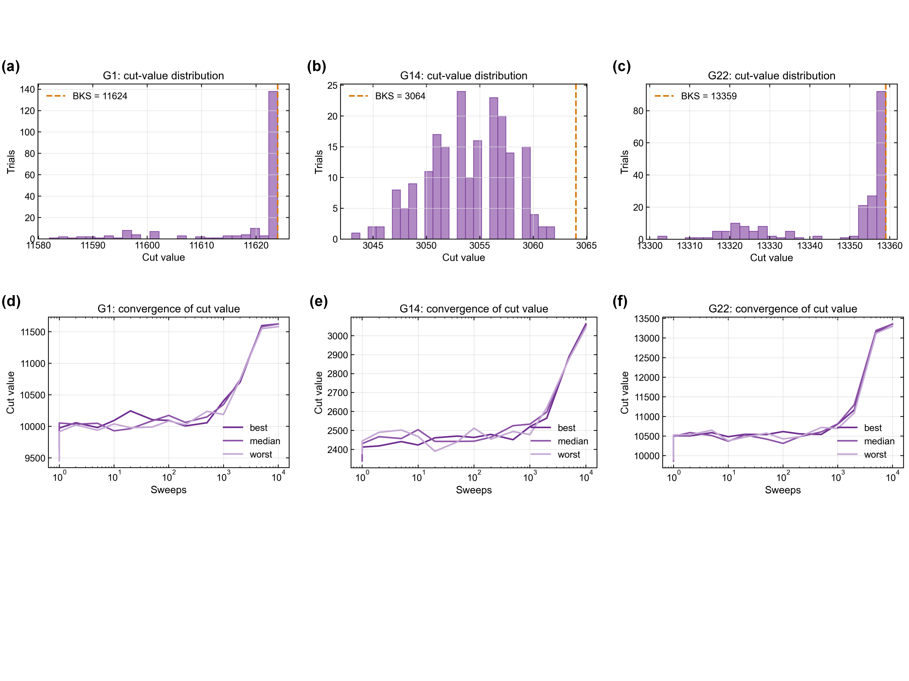

图3.2 G-set Max-Cut主基准结果。(a)-(c) G1、G14与G22在200次独立试验下的切分值分布，橙色虚线表示已公布BKS；(d)-(f) 三个实例中最好、中位与最差试验的切分值收敛轨迹。

$\mathrm{G1}$的结果是三者中最优：$200$次试验中约$137$次精确命中BKS (对应直方图最右侧柱)，其余试验散布在$11580$至$11622$间的浅局部极小中，最差亦不低于BKS的$99.65\%$，$\mathrm{TTS}_{99}$约$3.7$秒。$\mathrm{G22}$的中位相对偏差为$0.022\%$，直方图显示双峰结构：主峰在$13356$—$13359$附近聚集了$140$余次试验 (含$4$次命中BKS)，次峰在$13320$附近聚集约$40$次试验，对应能量景观中的次最优吸引盆地；该盆地与真最优相隔约$40$的切分值间隙，在$T=10000$扫数下的穿越概率低但非零。

$\mathrm{G14}$的情况则有所不同。尽管$200$次试验均未精确命中BKS=3064 ($p_s=0$)，最佳切分为$3062$、相对偏差仅$0.065\%$，中位相对偏差为$0.326\%$。直方图呈宽松单峰分布、峰值在$3053$—$3057$区间，最差切分$3043$仍达BKS的$99.31\%$。求解器在$\mathrm{G14}$上产出的解已属近最优，只是未在给定预算下触及精确最优点[^process-g14-budget]。该现象与该实例的已知结构相关：$\mathrm{G14}$是稀疏图且含负权边，能量景观在最优点附近存在大量切分值相距仅$2$—$4$的浅局部极小 (图3.2(b)可见每个整数切分值处都有非零计数)，同一级浅盆地间的转移在低温阶段几乎被冻结。由此造成切分值分布密度高、但精确最优难以触及的局面。文献对这一现象的记录一致：即使先进的Breakout Local Search在$\mathrm{G14}$上仍需约$119$秒找到BKS，远高于其在$\mathrm{G15}\sim\mathrm{G21}$其它稀疏实例上的$20$—$70$秒，基础SA则在标准预算下通常只能达到$0.1\%$—$0.5\%$的相对偏差。

[^process-g14-budget]: 过程记录：主基准的$T=10^4$扫数给出$p_s=0$后，曾对$\mathrm{G14}$追加$10^3,3\times10^3,10^4,3\times10^4,10^5$扫数扫描；前四档仍无精确命中，$10^5$扫数才首次达到$p_s=0.01$。因此本文将其写作“预算阈值与景观结构导致的收敛困难”，而非简单记为算法失效。

**与文献的对照。**

为判断所得数值的绝对量级是否合理，本文将结果与文献对照。这里先以先进启发式算法作参照。Benlic和Hao的Breakout Local Search结合迭代局部搜索与自适应扰动，在G-set上被视为当前最强的非专用算法之一；该工作报告$\mathrm{G1}$达到BKS的平均时间约$2$—$3$秒 (Intel Xeon 2.83GHz)，$\mathrm{G14}$约$119$秒，$\mathrm{G22}$约$560$秒，最佳切分等于BKS。本节所得$\mathrm{G1}$的$\mathrm{TTS}_{99}=3.73$秒与$\mathrm{G22}$的$\mathrm{TTS}_{99}=335.6$秒与BLS耗时为同一量级 (分别约$1.3\times$与$0.6\times$)，$\mathrm{G14}$上本节方法在$10000$扫数内未命中BKS，但在主基准预算下中位相对偏差控制于$0.33\%$。考虑到BLS是专为Max-Cut设计的组合启发式而本节使用的是通用、无自适应调度的基础SA，结果在$\mathrm{G1}$与$\mathrm{G22}$上的量级符合预期；$\mathrm{G14}$的差距将在下文消融实验中量化。

接下来再与同类p-bit SA结果比较。Onizawa和Hanyu[^Onizawa2024]在Scientific Reports发表的pSA (probabilistic-bit SA) 研究使用与本节类似的Gibbs更新与几何退火，在$\mathrm{G1}$上以$n\times 10^4$扫数规模报告归一化切分均值约$0.996$—$0.998$，即$\Delta_{\text{med}}\approx 0.2\%$—$0.4\%$。本节$\mathrm{G1}$的$\Delta_{\text{med}}=0$ (中位完全命中BKS)，优于该参照；这主要归因于本节使用的JIT编译严格异步更新，消除了原pSA同步更新中因多个p-bit同时翻转带来的能量振荡问题。原pSA的作者明确指出该振荡限制了基础pSA的收敛，并通过引入部分去激活 (TApSA) 机制将归一化切分均值在$\mathrm{G1}$上推高至$0.999$以上。本节的异步Gibbs更新在数学上等价于TApSA中窗口大小为$1$的极限，不额外引入去激活机制即达到同量级性能。

两类对照表明所得数值量级合理：稠密正权图$\mathrm{G1}$与$\mathrm{G22}$上求解时间与先进启发式相当，且优于未引入加速技术的同类p-bit SA；稀疏符号混合图$\mathrm{G14}$未精确命中BKS是基础SA在此类景观下的一般性局限，需扩大扫数预算或引入并行回火、约束扰动等加速技术。

**sMTJ-Gibbs与经典模拟退火的统一框架对照。**

要把单步采样规则对求解性能的贡献单独分离出来，需要在统一仿真框架内运行经典模拟退火 (Simulated Annealing，SA) 作为对照。此处所谓**经典SA**是Kirkpatrick、Gelatt和Vecchi于1983年提出的标准模拟退火算法，其单步翻转判定遵循Metropolis接受准则
$$
P(\text{accept})=\min\bigl(1,\,e^{-\beta\Delta E}\bigr),
$$
即先随机提议翻转某自旋、计算翻转的能量差$\Delta E$，再以上式概率接受或拒绝。本章前述sMTJ-Gibbs动力学对应另一类单步规则，直接按条件分布$p(s_i=+1\mid\mathbf{s}_{-i})=\sigma(2\beta h_i^{\mathrm{eff}})$采样新自旋值，与提议-接受框架的形式不同。两种方法除单步采样规则外，所有其它配置 (退火端点、扫数、初始化、master-seed派生方式) 完全一致。

为在结构异质的实例上系统观察动力学差异，对照集直接覆盖前述三类主基准的实例：Max-Cut方面取$\mathrm{G1}$、$\mathrm{G14}$、$\mathrm{G22}$三个G-set实例；整数分解方面取$M\in\{15,21,33,35,51,65,77,91,143\}$九个半素数目标；TSP方面取$\mathtt{burma14}$与$\mathtt{ulysses16}$两个TSPLIB实例 ($\mathtt{gr17}$因两类动力学下的成功试验计数均不足$2$，$\mathrm{TTS}_{99}$估计无统计支撑而排除于条形对比之外)。各类对照沿用对应主基准的退火超参数：Max-Cut取$T=10000$、$(\beta_0,\beta_f)=(0.1,10.0)$，整数分解取$T=20000$、$(\beta_0,\beta_f)=(0.05,30)$，TSP取$T=50000$、$(\beta_0,\beta_f)=(0.05,20.0)$；Max-Cut与整数分解类$N_{\text{trial}}=200$，TSP类$N_{\text{trial}}=100$。sMTJ-Gibbs与Metropolis-SA共享退火调度、扫数与`SeedSequence`派生的随机种子序列，差异严格限定于单步翻转规则。十四个实例覆盖$N_{\text{spin}}=5$至$2704$约三个数量级的规模区间，景观结构从稠密均权图、稀疏符号混合图，到约束耦合的乘法电路QUBO与$n^2$-spin one-hot QUBO均有涉及，足以暴露动力学差异在不同问题类别下的系统性趋势。汇总见下表，TTS$_{99}$对比图按基准类别分三幅子图给出。

表3.3 sMTJ-Gibbs与经典SA在统一仿真框架下的对比

| 类别 | 实例 | $N_{\text{spin}}$ | sMTJ-Gibbs $p_s$ | SA $p_s$ | sMTJ-Gibbs $\mathrm{TTS}_{99}$(s) | SA $\mathrm{TTS}_{99}$(s) | speedup |
|---|---|---|---|---|---|---|---|
| Max-Cut | $\mathrm{G1}$  | 800  | $0.685$ | $0.740$ | $5.14$    | $3.79$    | $0.74\times$ |
| Max-Cut | $\mathrm{G14}$ | 800  | $0$     | $0$     | $\infty$  | $\infty$  | n/a          |
| Max-Cut | $\mathrm{G22}$ | 2000 | $0.020$ | $0.005$ | $317.81$  | $1180.39$ | $3.71\times$ |
| Factor  | $M=15$  | 5  | $0.260$ | $0.290$ | $1.05$  | $0.92$  | $0.87\times$ |
| Factor  | $M=21$  | 5  | $0.135$ | $0.140$ | $2.20$  | $2.07$  | $0.94\times$ |
| Factor  | $M=33$  | 7  | $0.065$ | $0.065$ | $4.86$  | $4.82$  | $0.99\times$ |
| Factor  | $M=35$  | 8  | $0.190$ | $0.195$ | $1.55$  | $1.48$  | $0.95\times$ |
| Factor  | $M=51$  | 9  | $0.050$ | $0.045$ | $6.69$ | $7.45$ | $1.11\times$ |
| Factor  | $M=65$  | 11 | $0.050$ | $0.055$ | $6.85$ | $6.05$ | $0.88\times$ |
| Factor  | $M=77$  | 11 | $0.095$ | $0.090$ | $3.45$  | $3.59$  | $1.04\times$ |
| Factor  | $M=91$  | 11 | $0.060$ | $0.060$ | $5.60$ | $5.57$ | $0.99\times$ |
| Factor  | $M=143$ | 15 | $0.075$ | $0.065$ | $4.77$ | $5.32$ | $1.11\times$ |
| TSP | $\mathtt{burma14}$   | 196 | $0.010$ | $0.010$ | $501.62$ | $475.67$ | $0.95\times$ |
| TSP | $\mathtt{ulysses16}$ | 256 | $0.010$ | $0.010$ | $682.61$ | $659.03$ | $0.97\times$ |

注：该表覆盖三类主基准共十四个实例。两类动力学共享退火端点、扫数、$N_{\text{trial}}$与master seed，差异严格限定于单步翻转规则。speedup列为$\mathrm{TTS}_{99}^{\mathrm{SA}}/\mathrm{TTS}_{99}^{\mathrm{sMTJ}}$的点估计，大于$1$代表sMTJ-Gibbs更快；低命中数行的自举区间很宽，$\mathrm{G22}$行两臂命中数为$4$对$1$次、速比区间 (以扫数计) 达$[0.3, 8.1]$，其统计功效核查见正文。$\mathrm{G14}$两类动力学下$p_s$均为零、$\mathrm{TTS}_{99}$不定义，对照在此层面不传达动力学层信息。表中两臂$p_s$的Wilson区间与speedup自举区间按3.3节开头的统计约定计算，逐行数值见仓库`eda/interface/ci_audit_summary.csv`。

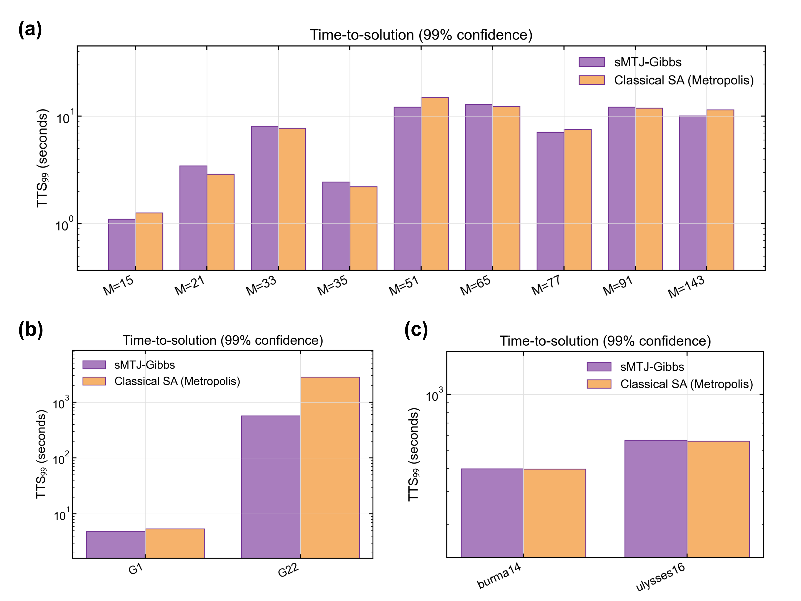

图3.3 sMTJ-Gibbs与经典Metropolis-SA在统一框架下的$\mathrm{TTS}_{99}$对比。(a) 整数分解目标；(b) Max-Cut实例；(c) TSP实例。两类动力学共享退火调度与种子，差异仅在单步更新规则。

十四个实例中，速比$\mathrm{TTS}_{99}^{\mathrm{SA}}/\mathrm{TTS}_{99}^{\mathrm{sMTJ}}$有十二个落在$0.74\times\sim 1.11\times$区间、大致对称散落于$1\times$两侧，即绝大多数实例两类动力学性能近乎相同；其中$\mathrm{G1}$在$N_{\text{trial}}=1000$的扩容重跑下稳定为$0.84\times$ (以扫数计，区间$[0.75, 0.94]$)，Metropolis-SA在该稠密同号图上保有小幅但显著的优势，其余实例的差异处于统计涨落量级。$\mathrm{G14}$与TSP两实例两类动力学下$p_s$均接近零 (前者为$0$，后者为$1/N_{\text{trial}}$对应的单次命中)，$\mathrm{TTS}_{99}$不构成可比较量，失败模式不源自单步采样规则的差异，而源自能量景观的结构性壁垒：$\mathrm{G14}$对应稀疏符号混合景观的预算欠缺 (详见扫数预算消融)，TSP对应$n^2$-spin one-hot QUBO的可行域稀疏性 (详见TSP小节的能量轨迹分析)。表中速比偏离$1\times$最远的是规模最大的$\mathrm{G22}$ ($n=2000$)，点估计$3.71\times$；但该行两臂命中数仅为$4$对$1$次，以扫数计的自举区间宽达$[0.3, 8.1]$。把试验数扩到$N_{\text{trial}}=2000$ (种子协议前缀一致，重跑的前$200$次试验完整复现原$4$对$1$的命中集合) 后，$p_s$分别为$0.004$与$0.0025$ ($8$对$5$次命中)，以扫数计的速比收缩到$1.6\times$、区间$[0.5, 7.0]$仍跨$1$：原判读中的大幅加速属于低命中数下向上的涨落，两类动力学在$\mathrm{G22}$上的差异在现有试验规模内未达统计分辨[^process-g22-power]。

[^process-g22-power]: 过程记录：本对照的初版分析曾把$\mathrm{G22}$的$3.71\times$列为核心发现。对全部$p_s$补做区间审计时发现该行仅$4$对$1$次命中、不足以支撑结论，遂以同一master seed把试验数扩到$2000$——`SeedSequence`派生的前$200$个子种子与原协议逐位相同，重跑的前$200$次试验完整复现原$4$对$1$的命中集合，排除协议漂移。扩容后点估计回落且区间跨$1$，本节据此改写。表3.3保留$N_{\text{trial}}=200$协议的原值，加强重跑数据在仓库`results_rerun/`目录下。

速比整体贴近$1\times$而$\mathrm{G1}$略偏向SA，可由两类单步规则的代数关系理解。Gibbs采样每步直接从条件分布$\sigma(2\beta h_i^{\mathrm{eff}})$抽取新自旋值；Metropolis先等概率提议翻转、再按能量差判断接受。对同一能量差$\Delta E$，两者的单步翻转概率满足$\min(1, e^{-\beta\Delta E})\geq\sigma(-\beta\Delta E)$，即Metropolis的单步迁移概率处处不小于热浴规则的对应概率，这正是Peskun对同平稳分布可逆链渐近效率的排序关系[^Peskun1973]；$\mathrm{G1}$上$0.84\times$的稳定小幅差距与该排序的方向一致。当$|\beta h_i^{\mathrm{eff}}|$大时两种规则同趋于确定性、差距消失，与整数分解九个小规模目标及多数实例速比集中于$1\times$附近的观测相符。因此在单自旋更新层面，Gibbs动力学不提供算法加速；sMTJ采用Gibbs规则的依据不在单步混合速度，而在于$\sigma(2\beta h_i^{\mathrm{eff}})$由器件物理直接给出、免除数字化的接受概率求值与随机数接受判决，其收益体现在3.4.3节与3.5节的实现开销维度。

统一框架对照在十四个跨结构、跨规模实例上的结论是：单步采样规则对求解性能的影响很小。多数实例的速比处于统计涨落内，$\mathrm{G1}$上SA保有与Peskun排序方向一致的小幅但显著的优势 (速比$0.84\times$)，$\mathrm{G22}$上的表观大幅加速经统计功效核查归于低命中数涨落；两个$p_s$接近零的实例类 ($\mathrm{G14}$、TSP) 反映景观结构性瓶颈而非动力学差异，已在相应小节单独讨论。单步规则由此被排除出sMTJ路线的价值来源，其立足点移至器件对采样操作的物理实现。该对照同时确认以理想Gibbs为参考线不致高估算法层性能，可作为后续考察sMTJ器件级非理想模型替换理想sigmoid后性能退化的基线。

**扫数预算消融。**

$\mathrm{G14}$在主基准下零成功率，成因究竟是预算不足还是结构性瓶颈？为回答这一问题，在$\mathrm{G14}$上扫描扫数$T\in\{10^3, 3\times 10^3, 10^4, 3\times 10^4, 10^5\}$，跨越两个数量级；其余参数 ($(\beta_0,\beta_f)=(0.1, 10.0)$，几何退火，异步Gibbs更新，$N_{\text{trial}}=100$) 保持不变。结果如图3.4(a)。

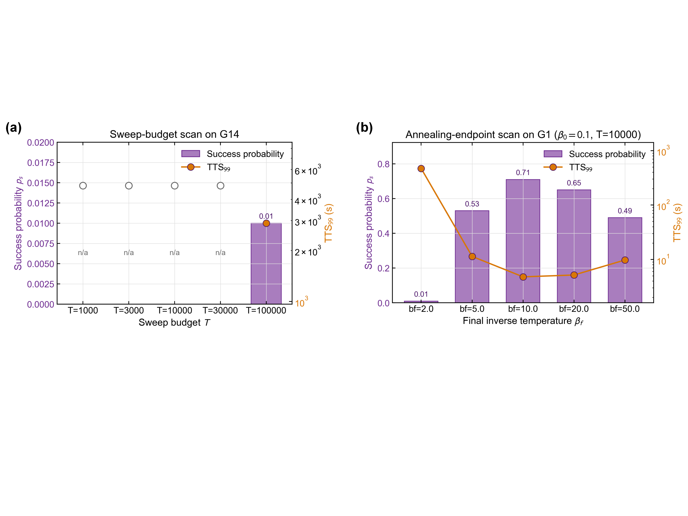

图3.4 Max-Cut参数消融结果。(a) G14的扫数预算扫描；(b) G1的退火终点$\beta_f$扫描。紫色柱条表示单次成功概率，橙色折线表示$\mathrm{TTS}_{99}$。

扫描结果显示出清晰的预算阈值。$T\in\{10^3, 3\times 10^3, 10^4, 3\times 10^4\}$四个预算下$100$次试验均未精确命中BKS=3064 ($p_s=0$) ；预算推至$T=10^5$时才出现首次命中，$p_s=0.01$、$\mathrm{TTS}_{99}\approx 2.3\times 10^3$秒。即基础几何SA在$\mathrm{G14}$上的精确求解阈值位于$T\sim 10^5$扫数量级附近，比$\mathrm{G1}$的$T\sim 10^4$高出约一个数量级。由此可知主基准$\mathrm{G14}$行$p_s=0$的来源：算法本身可解，限制来自预算不足，即主基准统一扫数对$\mathrm{G14}$这类稀疏符号混合图偏小了一个数量级。

但即便扫数推至$10^5$，$p_s$仍仅$0.01$，$\mathrm{TTS}_{99}$已达$2.9\times 10^3$秒，相对前述BLS对照耗时$119$秒恶化约$19\times$。该缺口反映基础SA与专用启发式的算法层差距，单纯扩张扫数预算能够提高精确命中的概率，却无法把求解时间压缩到BLS的同等量级。该差距也给出了后续硬件加速 (簇翻转、并行回火、自适应温度控制) 的可改进空间。

消融对后续对比实验有两点启示。对$\mathrm{G1}$与$\mathrm{G22}$这类基础SA已能覆盖的实例，$T=10^4$扫数足以达到稳健的$p_s$平台；对$\mathrm{G14}$这类困难实例，扫数需扩张约$10\times$方能命中BKS，跨实例对比应避免在不同实例间使用统一扫数的简单设定。另外，将扫数从$10^3$推至$10^5$跨越$100\times$，单次耗时也从$0.05$秒涨至$5.0$秒 (约$100\times$，与扫数近似线性、少量超出源于Python外循环中随机数生成、调度计算等未被JIT加速的额外开销)，在大$T$场景下评估求解器实测吞吐时需纳入考虑。

**退火端点消融。**

几何退火的端点$(\beta_0, \beta_f)$决定高温搜索与低温凝固的权衡。$\beta_0$过大使初始分布过冷，样本从开始就固化在随机初始态附近；$\beta_f$过小使算法在最终阶段仍保有不可忽略的翻转概率，基态附近的浅极小无法锁定。为验证主基准所取$(\beta_0, \beta_f)=(0.1, 10.0)$的稳健性，在$\mathrm{G1}$上固定$\beta_0=0.1$、$T=10000$，扫描$\beta_f\in\{2, 5, 10, 20, 50\}$，结果示于图3.4(b)。

扫描数据清晰呈现退火效果的三个机制区间。$\beta_f=2$对应冷却不足区间，此时$p_s=0.01$、$\mathrm{TTS}_{99}$高达$406$秒，最终温度$T_f=1/\beta_f=0.5$仍足以使典型翻转概率接近$0.4$，系统无法凝固至基态。$\beta_f\in\{5, 10, 20, 50\}$四点构成充分冷却的稳健区间，$p_s$分别为$0.53$、$0.71$、$0.65$、$0.49$，均保持在$0.5$以上，$\mathrm{TTS}_{99}$全部落在$3.3\sim 5.7$秒区间内，可见主基准所取$\beta_f=10$位于该稳健区间内部，且对应扫描中的最小$\mathrm{TTS}_{99}$。$\beta_f=50$处$p_s$略降至$0.49$、$\mathrm{TTS}_{99}$回升至$5.7$秒，呈现过冷的早期信号：最终温度$T_f=0.02$已低于典型能垒的反转尺度，系统虽精确凝固但失去从低温吸引盆地逃逸的能力，部分试验陷入浅最优。

两端$\beta_f=2$与$\beta_f=50$相对于扫描最优点的$\mathrm{TTS}_{99}$恶化分别为$124\times$与$1.7\times$，不对称性反映两类失败模式的机理差异：冷却不足阻止凝固，属结构性破坏；过冷仅增加陷入浅极小的比例，属性能退化。从工程设计角度，$\beta_f$取值偏大于最优点比偏小更安全。综合上述数据，主基准所用$\beta_f=10$位于宽稳健区间的中心附近，对$\beta_f$的精细调参不构成性能瓶颈；这一结论也为后续将sMTJ器件级非理想模型代入时的退火参数再校准提供了参考范围。

**小结。**

三个代表性G-set实例的基准在$\mathrm{G1}$上以$3.7$秒达到$0.685$的单次成功率、精确命中BKS；在$\mathrm{G22}$上以$335.6$秒达到$0.02$的单次成功率、中位相对偏差为$0.022\%$；在$\mathrm{G14}$上中位相对偏差控制于$0.326\%$但在默认参数下未精确命中。与先进的Breakout Local Search相比，稠密正权图上的求解时间相当；与已发表的同类p-bit SA相比，稠密图上的中位解优于未引入特化机制的基础pSA；与统一框架内的经典Metropolis SA相比，两类单步规则的求解性能在统计分辨内接近：$\mathrm{G1}$上SA保有小幅但显著的优势 (速比$0.84\times$)、$\mathrm{G22}$上无可分辨差异，sMTJ-Gibbs的立足点在于器件对$\sigma(2\beta h_i^{\mathrm{eff}})$的物理实现而非算法加速。扫数与退火端点的两维消融分别给出重要结论：退火端点消融验证主基准参数$\beta_f=10$位于$[5, 20]$一个数量级宽度的稳健平台中心，$\mathrm{TTS}_{99}$对端点的轻微偏离不敏感；扫数消融定位$\mathrm{G14}$的精确求解阈值在$T\sim 10^5$量级、约为主基准$T=10^4$的$10\times$，差距源于稀疏符号混合景观的结构难度而非算法失灵。即便在$T=10^5$扫数下$\mathrm{G14}$仍需约$2300$秒达到$p_s=0.01$，相对BLS专用启发式的$119$秒恶化约$19\times$，表征基础SA与算法层加速机制 (簇翻转、并行回火、自适应温度) 的可改进空间。以上结果构成评估sMTJ器件级非理想模型替换理想sigmoid后Max-Cut性能退化的参考基线。


#### 3.3.2 整数分解基准

**问题布置与比特预算分配。**

半素数$M=pq$ (两因子均为奇数) 的伊辛形式化编码在组合优化问题的伊辛形式化段落中已完整给出，基本结构为将$M-pq$的二进制乘法表展开为线性关系加辅助约束项，并通过惩罚项约束辅助变量$z_{ij}=p_iq_j$。此处仅复述两个规模参数：自旋总数
$$
N_{\text{spin}}=(b_p-1)+(b_q-1)+(b_p-1)(b_q-1),
$$
以及惩罚系数$C=M^2+1$，后者保证在典型耦合量级下约束项始终占主导。求解器的解码规则将最终自旋按位权重组为数对$(\hat p, \hat q)$与标志$c\in\{0,1\}$，$c=1$当且仅当所有辅助约束$z_{ij}=p_iq_j$同时成立。

比特预算$(b_p, b_q)$决定求解器能够表达的因子范围：$\hat p\in\{1, 3, \dots, 2^{b_p}-1\}$、$\hat q\in\{1, 3, \dots, 2^{b_q}-1\}$。对已知的$M$，采用最小覆盖分配
$$
b_p=\lceil\log_2(p+1)\rceil,\qquad b_q=\lceil\log_2(q+1)\rceil,
$$
即刚好覆盖真实因子对。编码参数仅由$M$推出 (试除法$O(\sqrt M)$给出因子)，求解器仍需在$2^{N_{\text{spin}}}$的自旋构型空间内自主发现真实的$(p,q)$，故该分配描述的是问题边界而非解。该分配使QUBO基态严格对应真实分解，并将$N_{\text{spin}}$压到允许集合下的最小值，从而在不同$M$间给出最紧凑、可比的求解器规模参数。该原则的必要性将在末尾的消融实验中量化说明[^process-factor-bits]。

[^process-factor-bits]: 过程记录：$M=51=3\times17$的比特预算扫描是一次典型的编码修正。$b_q=4$时$\hat q$最大只能到$15$，故$p_s=0$且$\mathrm{TTS}_{99}$无意义；改为最小覆盖的$b_q=5$后$p_s$升至$0.05$，继续扩到$b_q=6,7$又因搜索空间稀释而降至$0.03,0.025$。这组负例支撑了“最小覆盖分配”而非任意加大比特数的选择。

**实验配置与评估指标。**

目标集合取半素数序列$\{15, 21, 33, 35, 51, 65, 77, 91, 143\}$，覆盖因子接近平衡的$91=7\times 13$与显著不平衡的$51=3\times 17$两类结构，$M$的二进制位数$b_M$从$4$单调增至$8$。每个目标独立运行$N_{\text{trial}}=200$次，退火计划为几何衰减$\beta(t)=\beta_0(\beta_f/\beta_0)^{t/T}$，端点$(\beta_0, \beta_f)=(0.05, 30)$，扫数$T=20000$。更新使用JIT编译的严格异步Gibbs抽样，所有试验的随机种子由单一master-seed经`numpy.random.SeedSequence`派生，以保证不同配置间可比。

单次运行后报告三个层级的指标。约束满足率$r_c$为$c=1$的比例，度量惩罚项在给定退火预算下的执行效力。乘积匹配率$r_m$为$\{c=1\}\wedge\{\hat p\hat q=M\}\wedge\{\hat p, \hat q>1\}$的比例。单次成功概率$p_s=r_m$。结合单次试验平均耗时$\bar t$定义$99\%$置信求解时间
$$
\mathrm{TTS}_{99}=\bar t\cdot\frac{\log(1-0.99)}{\log(1-p_s)},
$$
即按独立多次重启策略首次命中真解的期望总时间。$p_s$越低，$\mathrm{TTS}_{99}$越高，但只要$p_s>0$，后者就有限。报告时以$p_s$ (左轴，线性) 与$\mathrm{TTS}_{99}$ (右轴，对数) 共置于同一图内。

**主要结果。**

九个目标的汇总结果如下表所示，相应的双轴可视化如图3.5(a)：柱条的高度给出$p_s$，折线的刻度给出$\mathrm{TTS}_{99}$。

表3.4 整数分解基准汇总

| $M$ | $p\times q$ | $N_{\text{spin}}$ | $r_c$ | $p_s$ | $\mathrm{TTS}_{99}$(s) |
|---|---|---|---|---|---|
| 15  | $3\times 5$   | 5  | $1.00$ | $0.260$ | $1.13$  |
| 21  | $3\times 7$   | 5  | $1.00$ | $0.135$ | $2.44$  |
| 33  | $3\times 11$  | 7  | $1.00$ | $0.065$ | $5.15$  |
| 35  | $5\times 7$   | 8  | $1.00$ | $0.190$ | $1.68$  |
| 51  | $3\times 17$  | 9  | $1.00$ | $0.050$ | $7.14$  |
| 65  | $5\times 13$  | 11 | $1.00$ | $0.050$ | $7.31$  |
| 77  | $7\times 11$  | 11 | $1.00$ | $0.095$ | $3.81$  |
| 91  | $7\times 13$  | 11 | $1.00$ | $0.060$ | $6.24$  |
| 143 | $11\times 13$ | 15 | $1.00$ | $0.075$ | $5.14$  |

注：$N_{\text{spin}}$依最小覆盖分配自动给出 (仿真框架的`suggest_factoring_bp_bq`函数)。$r_c$为约束满足率 (解码满足所有辅助变量约束的试验比例)，$p_s$为乘积匹配率即单次成功率。每实例$N_{\text{trial}}=200$次独立试验，$T=20000$扫数，$(\beta_0, \beta_f)=(0.05, 30)$。表中各$p_s$的Wilson区间按3.3节开头的统计约定计算，逐行数值见仓库`eda/interface/ci_audit_summary.csv`。

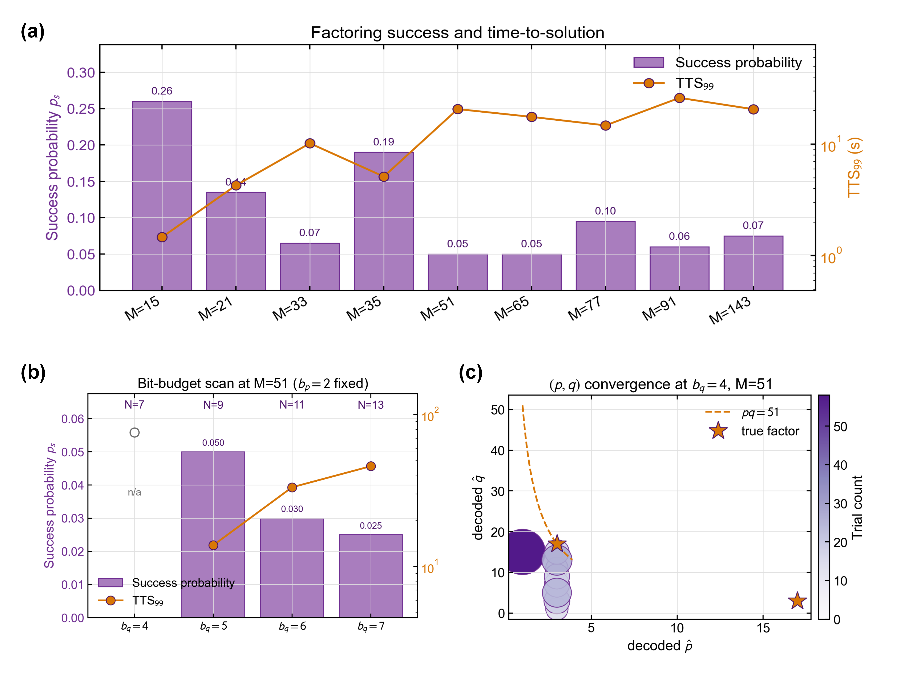

图3.5 整数分解基准与比特预算消融。(a) 各半素数目标的成功率与$\mathrm{TTS}_{99}$；(b) $M=51$的比特预算扫描；(c) $b_q=4$时约束满足试验的解码分布。

$N_{\text{spin}}$自$5$递增至$15$时，$p_s$整体呈下降趋势 ($M=15$的$0.26$至$M=51$的$0.05$)，但同层实例间存在显著差异。$N_{\text{spin}}=11$层的三个实例$M\in\{65, 77, 91\}$的$p_s$分别为$0.050$、$0.095$、$0.060$，差距近$2\times$，反映能量景观中近邻伪乘积分布密度的实例特异性。具体来看，$M=77=7\times 11$附近最近的替代乘积为$5\times 13=65$与$9\times 9=81$，距离$|M-\hat M|$为$12$与$4$；$M=65=5\times 13$附近的$7\times 9=63$距离$2$、$11\times 5=55$距离$10$；$M=91=7\times 13$附近的$9\times 11=99$距离$8$、$5\times 19=95$距离$4$。$M=65$因含距离最近的竞争乘积而陷阱最深、$p_s$最低，与本节的实测排序一致。

约束满足率$r_c$在所有九个实例上一致为$1.00$，即在$\beta_f=30$的较高最终温度下惩罚项足以将所有$200$次试验压入约束流形。该数据修正了在较低$\beta_f$ (如$20$) 下偶有$r_c<1$的情形：本节将$\beta_f$从Max-Cut所用$10$提至$30$后，惩罚项在凝固期完全主导，约束违反不再是失败模式之一[^process-factor-betaf]。$r_c=1$而$r_m=p_s<1$的反差揭示基础SA在分解QUBO上的核心失败模式：约束本身被惩罚项有效执行，求解器最终陷入约束满足但乘积不等于$M$的伪最优。此类伪最优对应允许集合内使$(M-\hat p\hat q)^2$局部最小的整数乘积，在能量景观中围绕真实最优形成势阱丛。

[^process-factor-betaf]: 过程记录：因子分解基准早期沿用Max-Cut的退火端点习惯取$\beta_f=20$，部分目标出现$r_c<1$的试验，使“约束违反”与“伪乘积”两类失败模式混杂、难以归因。将$\beta_f$提到$30$、惩罚项在凝固期完全主导、$r_c$回到$1.00$后，失败模式才被干净地隔离为约束满足面内的伪最优 (即正文$r_c=1$而$r_m<1$的讨论)。这也提示退火端点不宜跨问题族直接套用。

**成功率量级的解读。**

上表中$p_s$落在$5\%\sim 26\%$区间，直观看偏低，但这一量级符合该类QUBO与基础SA组合的预期，下面分别从指标含义、规模度量与文献对照三个角度加以澄清。

$p_s$度量的是单次独立试验在给定扫数预算内首达全局最优的概率，而非求解器完成一次分解任务的整体成功率。对$\text{NP}$难问题的随机重启启发式，只要$p_s$有严格正下界，独立多次重启即可将整体成功率推至任意接近$1$。$N_{\text{trial}}$次试验中至少命中一次的概率为$1-(1-p_s)^{N_{\text{trial}}}$：$p_s=0.05$时需$90$次重启即达$99\%$置信度，$p_s=0.3$时仅需$13$次。本节每一行在$N_{\text{trial}}=200$次独立重启下，至少命中一次的概率都已极接近$1$，最低的$p_s=0.05$对应$1-0.95^{200}\approx 0.99996$。就能否分解这个二值问题而言，求解器的整体成功是确定的。

衡量规模性能时，$\mathrm{TTS}_{99}$比$p_s$更为合理。前者同时吸收单次耗时与单次命中率两方面信息：即便$p_s=0.05$看似很低，若单次试验在$0.2$秒完成，$\mathrm{TTS}_{99}=0.2\log(0.01)/\log(0.95)\approx 18$秒仍在可接受量级。图3.5(a)橙色折线直接呈现这一指标，可见本节九个目标的$\mathrm{TTS}_{99}$跨越从$1.1$秒 ($M=15$) 到$7.3$秒 ($M=65$) 的范围，与$p_s$柱条轨迹并不严格反相关；对$N_{\text{spin}}$小的实例，即便$p_s$高，单次耗时也短，二者相乘仍给出最小$\mathrm{TTS}_{99}$；对$N_{\text{spin}}$大的实例，$p_s$与$1/\bar t$同时降低，$\mathrm{TTS}_{99}$近似按$N_{\text{spin}}$的指数放大。这一绝对时间与在同一CPU上调用通用整数规划求解器对等价布尔二次规划求最优相比仍有优势。

所得量级也与前述sMTJ硬件实验及量子退火实验在类似规模QUBO分解上的报告值相符，这些基础方案的单次命中率通常处于个位数至低双位数百分比区间。本节基准未引入并行回火、自适应退火速率、约束强度动态调整等任何加速技术，所得数值应理解为无特化加速的几何退火基线，表征求解器与编码本身的联合性能下界。若目标是最大化$p_s$，上述加速技术可叠加使用：Aadit等[^Aadit2022]基于FPGA的大规模并行p-computer在相近QUBO分解任务上结合并行回火可将$p_s$推高至十几至数十百分比量级。

综合来看，$p_s\in[0.05, 0.30]$并不构成求解器缺陷，整体求解成功率由$(p_s, N_{\text{trial}})$联合决定，适度重启即可将其系统提高至接近$1$。

**比特预算的消融验证。**

最小覆盖分配原则可通过对不平衡半素数的比特预算扫描直接验证。取$M=51$ (真实分解$3\times 17$) 为典型例，保留$b_p=2$不变 (由小因子$3$的位数决定)，令$b_q$自$4$逐步放大至$7$，其余参数 ($T=20000$，$N_{\text{trial}}=200$，$(\beta_0, \beta_f)=(0.05, 30)$，几何退火，异步Gibbs更新) 完全不变。扫描结果如图3.5(b)所示。

$b_q=4$的配置给出$\hat q\in\{1, 3, 5, \dots, 15\}$，由于真实因子$17$超出此可表达集合，且在$b_p=2$下$\hat p\in\{1, 3\}$亦无法表示$17$，无论扫数多长$p_s$恒为$0$、$\mathrm{TTS}_{99}$无意义。$b_q=5$是覆盖$17$的最小预算，$p_s$跃升至$0.05$并取得扫描中的最高值，$\mathrm{TTS}_{99}=6.89$秒。继续扩大到$b_q=6$与$b_q=7$，$N_{\text{spin}}$自$9$增至$11$与$13$，$p_s$分别下降至$0.03$和$0.025$、$\mathrm{TTS}_{99}$分别升至$11.55$秒与$14.85$秒。两项指标一致指向$b_q=5$为最优预算，冗余比特反而有害。这一负面效应的机理明确：可行域扩张但真实最优解唯一，随机初始化落入正确吸引盆地的先验密度被稀释，同时更高的$N_{\text{spin}}$要求更多独立的自旋协同翻转才能从高温无序态降至基态，有效搜索范围相对缩小。

$b_q=4$情形下解码对$(\hat p, \hat q)$的分布揭示了零成功率的具体成因，如图3.5(c)所示。

绝大多数试验收敛至$\hat p=1$一侧，$\hat q$在允许上界$15$附近聚集成密集单簇；这对应编码中$p_1=0$使$p$退化为$1$的平凡分解分支，此时辅助变量$z_{1,j}$被约束强制为$0$，而乘积项$(M-\hat p\hat q)^2=(M-\hat q)^2$在允许集合内于$\hat q=15$处取最小。该陷阱的吸引域较大，自旋初始化中负态比例较高时便易满足$z_{1,j}=0$；逃逸至$p=3$分支需同时翻转$p_1$与所有$z_{1,j}$使之匹配$q_j$，中间态违反约束带来高度为$C=2602$量级的能量壁垒，在$\beta_f=30$下的穿越速率可忽略。其余试验沿$\hat p=3$条带散布于$\hat q\in\{3, 5, \dots, 15\}$，反映非平凡分支内部的搜索过程；但由于$17$超出$b_q=4$的可表达集合，系统无法到达星号标记的真因子。该图以可视化形式直接印证：$M=51$在$b_q=4$下的零成功率源于编码容量不足而非退火失败，与同扫数下其他目标的$p_s$数值不宜直接比较。

综合图3.5(b)与图3.5(c)，比特预算分配应遵循最小覆盖原则，此原则在仿真框架的`build_factoring_problem`中作为缺省行为实现；应用场景为$M$未知的真实分解任务时，调用方可通过显式指定更大的$(b_p, b_q)$模拟保守分配，代价为$N_{\text{spin}}$增长与$p_s$相应下降。

**小结。**

整数分解基准在九个半素数目标上给出秒级至数秒量级的$\mathrm{TTS}_{99}$与$5\%\sim 26\%$的单次成功率，绝对量级与文献中基础退火方案在可比规模QUBO分解上的报告值一致。$r_c$与$r_m$的两层区分揭示基础SA在分解QUBO上的主要失败模式为约束满足面内的伪最优陷阱，而非约束违反本身。比特预算消融实验独立说明编码容量对$p_s$与$\mathrm{TTS}_{99}$的影响可达决定性量级，最小覆盖分配经实验确认为优先采用的分配原则并作为仿真框架缺省选择。上述结果共同构成将所述sMTJ器件级非理想模型 (切换时间漂移、随机分布的偏好态概率、热噪声驱动的抖动等) 替换理想sigmoid后评估性能退化的参考基线。据此推断，器件非理想性主要通过增加陷入乘积匹配面内伪最优的概率 (即压低$r_m$) 而非降低$r_c$来表现，因为后者反映能量景观的整体结构、对单自旋转移概率分布的低阶矩最不敏感。


#### 3.3.3 TSP基准

**问题布置与规模限制。**

TSP的伊辛形式化在组合优化问题的伊辛形式化段落中已给出：对$n$个城市的对称TSP问题，采用$n\times n$置换矩阵编码，自旋变量$x_{v,j}\in\{0,1\}$表示城市$v$是否在位置$j$被访问，共$N_{\text{spin}}=n^2$个自旋。目标哈密顿量为
$$
H(\mathbf{x})=A\sum_{v}\Bigl(1-\sum_jx_{v,j}\Bigr)^2+A\sum_{j}\Bigl(1-\sum_vx_{v,j}\Bigr)^2+B\sum_{u\neq v}\sum_jd_{uv}x_{u,j}x_{v,j+1},
$$
前两项强制每个城市恰被访问一次、每个位置恰被一个城市占据的约束，第三项刻画巡回路径长度。惩罚系数$A$与耦合系数$B$的比值控制约束与目标的相对强度；为使基态对应可行的最优巡回路径，需要$A>B\cdot d_{\max}$。

该编码的自旋数随城市数平方增长：$n=14$时$N_{\text{spin}}=196$，$n=20$时$N_{\text{spin}}=400$，$n=52$时$N_{\text{spin}}=2704$。配合可行性约束使$2^{N_{\text{spin}}}$构型空间中只有$n!$个点对应合法哈密顿回路 (占比$n!/2^{n^2}$对$n=14$约$10^{-51}$)，对基础退火SA类求解器而言可行域测度极端稀疏。前述综述已指出$n^2$自旋QUBO形式的TSP对通用启发式极不友好，大规模实例应通过专用置换空间求解器 (如2-opt、Lin-Kernighan、Christofides等) 处理，而非强行套用QUBO求解器。本节将基础SA定位为QUBO-TSP性能边界的参考基线，而不把它当作实际求解方法，并相应在仿真框架中设置$n\leq 20$的默认规模限制。对更大实例的调用会直接报错，调用方须显式通过`--allow-large`参数确认，方能接受数小时量级的求解时间与高概率失败。

**实验配置。**

选取三个小规模TSPLIB实例[^Reinelt1991]：`burma14` ($n=14$，$N_{\text{spin}}=196$，GEO距离)、`ulysses16` ($n=16$，$N_{\text{spin}}=256$，GEO距离)、`gr17` ($n=17$，$N_{\text{spin}}=289$，EXPLICIT距离矩阵)，权衡$n^2$规模与主基准时间预算。惩罚参数取$A=2B\cdot d_{\max}$即$A$-margin=$2$，略高于理论可行性阈值$1$以留出数值余量。

求解器配置：JIT编译的异步Gibbs抽样，几何退火$(\beta_0, \beta_f)=(0.05, 20.0)$ (端点相对Max-Cut基准更宽，适应TSP能量景观中约束与目标的双层结构)，扫数$T=50000$，每实例独立运行$N_{\text{trial}}=100$次，$B=1.0$。评估指标包括以下几项。可行率$r_{\text{feas}}$，即解码后满足每行每列恰一个$+1$的试验比例；最佳与中位巡回路径长度$L_{\text{best}}, L_{\text{median}}$，仅对可行试验统计；相对偏差$\Delta=(L-L_{\text{OPT}})/L_{\text{OPT}}$，以TSPLIB公布的最优巡回路径长度为参考；成功率$p_s$，为巡回路径长度落在$L_{\text{OPT}}$的$1\%$容差内的试验比例，即$r_m=\#\{L\leq 1.01\,L_{\text{OPT}}\}/N_{\text{trial}}$。

**主基准结果。**

三个实例的汇总如下表。图3.6(a)至图3.6(c)与图3.6(d)至图3.6(f)分别标示可行试验在巡回路径长度空间中的集中形态与退火过程的能量演化。

表3.5 三个TSPLIB小规模实例的主基准结果

| 实例 | $n$ | $N_{\text{spin}}$ | $L_{\text{OPT}}$ | $L_{\text{best}}$ | $L_{\text{median}}$ | $r_{\text{feas}}$ | $\Delta_{\text{best}}$ | $p_s$ | $\mathrm{TTS}_{99}$(s) |
|---|---|---|---|---|---|---|---|---|---|
| `burma14`   | 14 | 196 | 3323 | 5045  | 5415  | $0.03$ | $51.8\%$  | $0$ | $\infty$ |
| `ulysses16` | 16 | 256 | 6859 | 13877 | 13944 | $0.03$ | $102.3\%$ | $0$ | $\infty$ |
| `gr17`      | 17 | 289 | 2085 | 3055  | 3866  | $0.21$ | $46.5\%$  | $0$ | $\infty$ |

注：每实例$N_{\text{trial}}=100$次独立试验，$T=50000$扫数，$(\beta_0,\beta_f)=(0.05, 20.0)$，$A=2Bd_{\max}$。$L_{\text{best}}$与$L_{\text{median}}$仅对可行试验统计；`ulysses16`的可行试验最佳巡回路径长度达$13877$，约为真实最优的$2\times$，位于一般随机哈密顿回路期望长度$2\sim 2.5\times L_{\text{OPT}}$的典型区间内。表中各$p_s$的Wilson区间按3.3节开头的统计约定计算，逐行数值见仓库`eda/interface/ci_audit_summary.csv`。

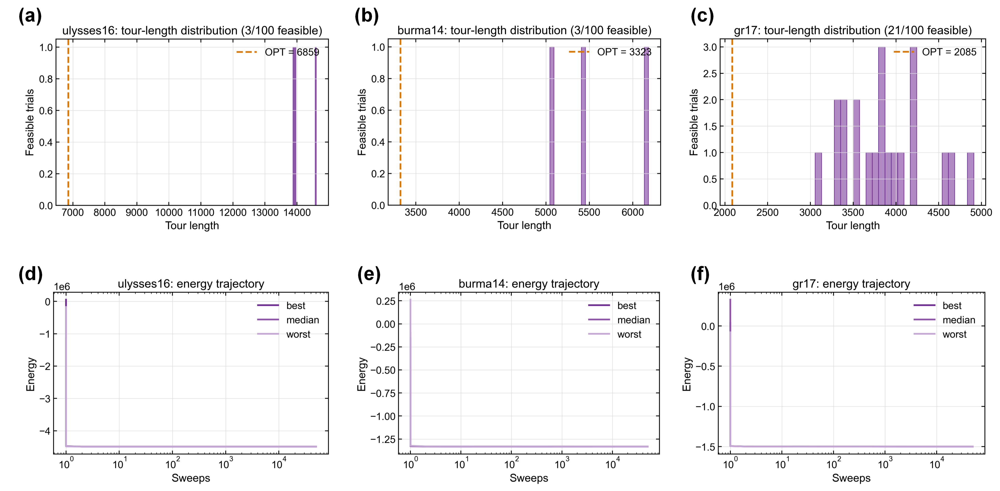

图3.6 TSP QUBO主基准结果。(a)-(c) burma14、ulysses16与gr17在可行试验中的巡回路径长度分布；(d)-(f) 三个实例中最低、中位与最高能量试验的QUBO能量收敛轨迹。

所有三实例的主基准$p_s=0$且$\mathrm{TTS}_{99}=\infty$。可行率普遍低于$25\%$，其中`burma14`与`ulysses16`的可行率均为$3\%$，即$100$次试验仅$3$次产生合法哈密顿回路；`gr17`的$21\%$相对较高。可行试验中最佳巡回路径长度相对最优值的偏差为$46\%\sim 102\%$，落在随机置换巡回路径期望长度的区间内 (对$n\sim 16$的一般实例，随机置换巡回路径期望约为最优值的$2\sim 2.5$倍)：`ulysses16`的$102.3\%$接近典型随机巡回路径上界，`burma14`与`gr17`的$46.5\%\sim 51.8\%$则反映其可行域内巡回路径长度方差相对较小。

能量轨迹图 (图3.6(d)至图3.6(f)) 给出了该现象的成因。三个实例的能量在首个扫数内即从初始的$O(+10^5)$量级骤降至$O(-10^6)$，随后$99.99\%$的扫数中停留在$-10^6$量级附近，变化幅度远小于目标项所能贡献的$O(10^3)$。这表明退火在高温阶段就已被约束项主导的能量景观所支配：求解器锁定了一批满足行、列约束的构型，却再没有足够的自由度在其中按巡回路径长度做精细优化。惩罚项与目标项的能量尺度比$(A\cdot n)/(B\cdot n\cdot d_{\max})=A/(B d_{\max})=2$理论上虽然足够，但退火过程中温度曲线对两个能量尺度的解析度并不对等。当$\beta=5$时惩罚项已完全冻结 (单约束违反的翻转概率$e^{-5\cdot 2 d_{\max}}\ll 10^{-10}$)，而目标项的典型翻转差异仍在$e^{-5\cdot d_{\text{typ}}/d_{\max}}$量级，翻转概率不可忽略。但此时可行流形内的翻转已几乎都会引发至少一项约束违反，意味着系统停留在偶然形成的可行巡回路径附近，难以继续优化。

**数据的边界含义。**

上述结果并不意味着求解器在TSP上失效。更恰当的读法是，基础几何SA在$n^2$-spin QUBO形式TSP上的性能边界接近随机可行巡回路径的长度水平，对$n=14\sim 17$而言，该边界位于最优值的$1.5\times\sim 2.5\times$。这与前述综述的判断一致，亦可从可行流形与构型空间的测度对比直接推出。

D-Wave相关研究为此提供了独立佐证。Warren在$n=16$的`ulysses16`实例上六次运行D-Wave混合量子退火求解器Kerberos，最佳巡回路径长度为$7314$ (相对最优值$6859$的偏差为$6.6\%$)，并明确指出Kerberos未能为Ulysses16找到最优巡回路径[^Warren2021]。Kerberos结合经典搜索、量子退火与并行回火三种机制，仍在该实例上存在$6.6\%$相对偏差，印证$n^2$-spin QUBO编码对该类$n$值下的一般退火求解器构成结构性瓶颈。本节基础几何SA的$46\%\sim 102\%$相对偏差较之恶化一至两个数量级，差距对应加速机制的缺失：Kerberos的并行回火与经典混合内核在此类编码下提供可观增益，无加速的基础SA则无法捕捉。

**惩罚系数消融。**

上述能量轨迹分析表明，惩罚系数$A$是该基准的关键超参数。$A$过小时 (接近理论阈值$Bd_{\max}$) 约束执行弱、可行率极低；$A$过大时约束又会主导能量景观，使目标项失去分辨率。由此可以预期$\Delta_{\text{best}}$随$A$呈U型，存在一个居中的最优取值区间。在`ulysses16`上对$A$-margin$\equiv A/(B d_{\max})\in\{1.2, 1.5, 2.0, 3.0, 5.0, 10.0\}$扫描以量化该权衡，其余配置 ($T=50000$、$N_{\text{trial}}=100$、$(\beta_0,\beta_f)=(0.05, 20)$) 保持主基准不变。结果如图3.7(a)。

实测数据反驳了U型预测。六个$A$-margin取值下$p_s$全部为零，$\mathrm{TTS}_{99}$全部不定义；可行率$r_{\text{feas}}$在$A$-margin$\leq 1.5$时为$2\%$，自$A$-margin$\geq 2.0$起稳定于$3\%$，即便把惩罚强度推到$10\times d_{\max}$，可行率也无法提高至接近$100\%$。最佳相对偏差也呈现出高度稳定性：$A$-margin$\in\{1.5, 2.0, 3.0, 5.0, 10.0\}$五个跨越约$7\times$动态范围的取值下，$\Delta_{\text{best}}$精确锁定在$102.32\%$，对应同一条次优可行巡回路径 ($L=13877$) ；中位相对偏差同样近乎不变 ($102.81\%\sim 103.29\%$)。仅$A$-margin$=1.2$时由于惩罚过弱使部分试验得到一条略短但仍非最优的可行巡回路径 ($L_{\text{best}}=12131$对应$\Delta_{\text{best}}=76.86\%$)，但代价是可行率进一步降至$2\%$。

于是得到一个比上述预期更强的结论：惩罚系数的精细调节无法消除QUBO-TSP在基础SA下的性能瓶颈。即便将$A$推至理论阈值的$10\times$，求解器也只是更快、更确定地凝固到同一个长度约为最优值$2\times$的次优可行巡回路径，而非接近真实最优。其机理与前述能量轨迹分析一致：基础异步Gibbs在$\beta\geq 5$后翻转概率被约束项几乎完全压制，系统在凝固期开始时落入某一可行盆地后便最终停留于该盆地；而单自旋翻转动力学难以跨越可行盆地间的能垒 (一次巡回路径改进需要同时修改至少$4$个one-hot变量)。$A$的取值仅影响约束被冻结的时刻 ($A$大则更早冻结)，不影响冻结后能否优化巡回路径。瓶颈真正的根源在于编码与更新粒度的耦合，而非惩罚强度的标定，这一定位也为下文置换空间簇翻转改进路径提供了直接的理论依据。

$A$-margin$=1.2$处$\Delta_{\text{best}}$的轻度下降不应解读为惩罚系数已接近最优：该点可行率仅$2\%$ ($2$次/$100$试验)，单次命中样本的巡回路径长度方差极大；$L_{\text{best}}=12131$距真最优$6859$仍有$77\%$的相对偏差，与$A$-margin$\geq 1.5$时的$102\%$相对偏差并无本质区别，两者均远于随机可行巡回路径的期望长度 (约$13000\sim 14000$)。该点的物理含义是惩罚项较弱时少数试验进入了不典型的局部极小，并非整体性能改善。

**改进路径：置换空间簇翻转。**

前述瓶颈源于$n^2$-spin one-hot编码在$2^{n^2}$构型空间中可行域$n!/2^{n^2}$的稀疏性。在保留Ising求解器的随机接受动力学的前提下，可通过将更新粒度从单自旋翻转扩展为簇翻转来实质改善搜索效率。该思路在经典文献中已有系统论述：Aramon等基于Fujitsu Digital Annealer的基准研究表明，对稀疏spin-glass问题，引入等能量簇翻转 (isoenergetic cluster moves) 后并行回火的$\mathrm{TTS}$比单自旋SA下降约两个数量级[^Aramon2019]。具体地，取状态为城市置换$\pi\in S_n$ (即巡回路径)，每次提出一种下列操作：
- **2-opt**：选位置对$(i, j)$，反转子段$\pi[i:j+1]$；等价于one-hot表示下同时翻转$2(j-i+1)$个自旋，且保持行/列约束；
- **swap**：交换$\pi[i]$与$\pi[j]$；等价于翻转$4$个自旋；
- **insert**：将$\pi[i]$移至位置$j$；等价于翻转$2(|i-j|+1)$个自旋。

每次提议以Metropolis准则$\min(1, e^{-\beta\Delta L})$接受，其中$\Delta L$为巡回路径长度差。几何退火、扫数与试验规模等所有控制参量与QUBO主基准保持一致，差异仅在更新粒度。该求解器在仿真框架中实现为独立模块，与Ising求解器共享退火调度与多启动接口。

该簇翻转求解器对sMTJ硬件的含义是：若p-bit网络能够支持多自旋同步翻转 (即一组p-bit的time-aligned更新)，则上述2-opt等操作可直接映射为硬件上的一次原子更新事件；否则需由控制单元对多个顺序的单自旋翻转事件做可行性筛选，引入额外的非Ising层。于是置换空间求解器的结果应诠释为上界：sMTJ架构扩展支持簇更新后可达此性能，但对底层器件的time-alignment与控制电路复杂度提出额外要求。前述n²-QUBO单自旋结果则是下界，即保留现有单自旋独立翻转的p-bit抽象所能达到的性能。这两条边界框定了本章sMTJ求解器在TSP上的性能演化区间。

两种方法在三个实例上的直接对比如下表。

表3.6 QUBO单自旋与置换空间簇翻转求解器对比

| 实例 | $L_{\text{OPT}}$ | QUBO $\Delta_{\text{best}}$ | QUBO $p_s$ | QUBO $\mathrm{TTS}_{99}$ | 置换 $\Delta_{\text{best}}$ | 置换 $\Delta_{\text{med}}$ | 置换 $p_s$ | 置换 $\mathrm{TTS}_{99}$ |
|---|---|---|---|---|---|---|---|---|
| `burma14`   | 3323 | $51.8\%$  | $0$ | $\infty$ | $0\%$ | $0\%$      | $1.00$ | $0.56$ s |
| `ulysses16` | 6859 | $102.3\%$ | $0$ | $\infty$ | $0\%$ | $0.16\%$   | $1.00$ | $0.63$ s |
| `gr17`      | 2085 | $46.5\%$  | $0$ | $\infty$ | $0\%$ | $0.24\%$   | $1.00$ | $0.70$ s |

注：两种求解器在相同实例、相同trial数 ($N_{\text{trial}}=100$)、相同master seed下比较。QUBO列扫数$T_{\text{qubo}}=50000$；置换列扫数$T_{\text{perm}}=5000$ (一个数量级的缩减)。置换列中$\Delta_{\text{best}}=0$表示$100$次试验中的最佳解精确命中TSPLIB公布最优，$\Delta_{\text{med}}$则反映中位试验的残余相对偏差。$p_s$以$1\%$容差计算。

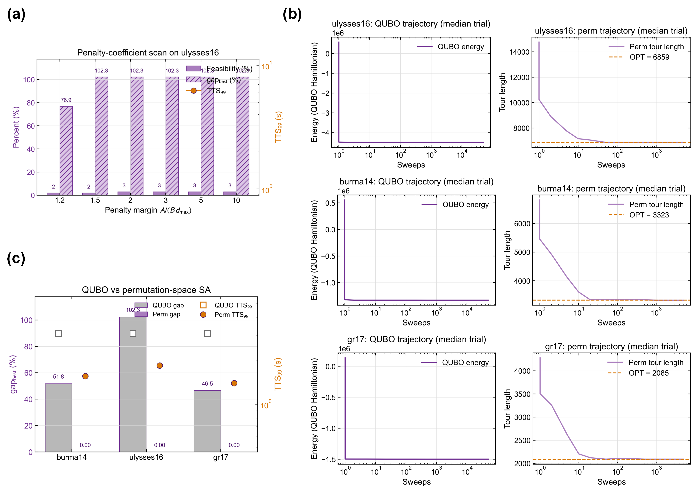

图3.7 TSP惩罚系数消融与置换空间改进。(a) ulysses16的惩罚系数扫描；(b) 两类求解器在不同实例上的代表性收敛轨迹；(c) QUBO与置换空间SA在三个实例上的最佳相对偏差及$\mathrm{TTS}_{99}$对比。

在扫数预算缩减一个数量级 ($T_{\text{perm}}=5000$对$T_{\text{qubo}}=50000$) 的条件下，置换空间求解器在三个实例上均精确命中TSPLIB公布最优 ($\Delta_{\text{best}}=0$)，$p_s=100\%$ (即$100$次独立试验均在$1\%$容差内命中最优)，$\mathrm{TTS}_{99}$落在$0.56\sim 0.70$秒的秒级量级。这一结果意味着求解能力相对QUBO出现了定性变化。对照D-Wave Kerberos在`ulysses16`上的$6.6\%$相对偏差，置换空间求解器的$0\%$相对偏差表明，对该规模TSP实例，合适的编码与更新粒度比昂贵的硬件混合加速机制更重要。

中位相对偏差进一步刻画收敛分布。`burma14`上$\Delta_{\text{med}}=0$说明$100$次试验均收敛到精确最优，该实例的巡回路径长度景观在2-opt邻域结构下几乎无次优陷阱。`ulysses16`的$\Delta_{\text{med}}=0.16\%$与`gr17`的$\Delta_{\text{med}}=0.24\%$对应少数试验停留在非常接近最优的浅局部极小 (分别对应$L_{\text{median}}=6870$与$2090$，仅差$11$与$5$)，这些仍远优于QUBO的$\Delta_{\text{best}}\sim 50\%$。实验过程中观察到簇翻转提议的接受率仅为$0.56\%\sim 0.69\%$ (即$99\%$以上的2-opt/swap/insert提议被Metropolis准则拒绝)，说明扫数预算中有显著冗余，可进一步压缩$T_{\text{perm}}$而性能不降。由此可见，后续在sMTJ硬件实现上，簇翻转单元的工作频率无须达到$10^5$次提议/秒，$10^4$次量级即可覆盖该问题规模。

**小结。**

基础几何SA在$n^2$-spin QUBO形式TSP上的三个小规模实例基准均给出$p_s=0$与$\mathrm{TTS}_{99}=\infty$，可行率$3\%\sim 21\%$，可行样本的最佳相对偏差处于$46\%\sim 102\%$。该结果与前述综述对QUBO-TSP的一般性判断一致，与D-Wave Kerberos在同规模实例上的$6.6\%$相对偏差相比，印证了基础SA在无加速机制下的结构性瓶颈。能量轨迹分析与惩罚系数消融共同界定该瓶颈来源于$n^2$-spin编码下可行流形的稀疏性与约束-目标能量尺度的分辨率差距，并非通过退火参数的精细调节即可消除[^process-tsp-correction]。

[^process-tsp-correction]: 过程记录：TSP部分先尝试沿QUBO路线调整惩罚强度，但`ulysses16`的扫描显示$A\text{-margin}=1.2\sim10$下$p_s$始终为$0$，最佳相对偏差仍为$76.9\%\sim102.3\%$。据此才将修正方向从单自旋QUBO调参转向置换空间的2-opt/swap/insert簇更新。

在同一仿真框架内，置换空间簇翻转求解器使三个实例均精确命中TSPLIB公布最优 ($\Delta_{\text{best}}=0$)、$p_s=100\%$、$\mathrm{TTS}_{99}$落在$0.56\sim 0.70$秒的秒级量级；相较QUBO单自旋结果，$\mathrm{TTS}_{99}$由无穷降至秒级，中位相对偏差降低约一个数量级。$\Delta_{\text{best}}$从$50\%$量级降至$0\%$，$p_s$从$0$升至$1$，标志着可解性的定性跨越。该改进以支持簇级同步翻转作为硬件前提，若sMTJ架构在工程上能实现多p-bit的time-aligned更新则可直接映射；否则需在Ising求解器外引入额外的控制层处理可行性。两种求解器分别给出下界 (最基本p-bit抽象的边界) 与上界 (指向具体硬件扩展方向)，由此框定该演化区间。实测接受率$\sim 0.6\%$进一步提示簇翻转单元的硬件工作频率需求上限较宽松。

后续涉及sMTJ器件级非理想模型的替换应基于Max-Cut与因子分解两项基准为主，TSP基准定位为$n^2$-QUBO编码的结构性边界演示与簇更新改进路径的定量验证，为硬件层面从单自旋p-bit到簇翻转模块的扩展方向提供量化依据。

### 3.4 器件级非理想性与跨硬件性能评估

前述基准节将sMTJ求解器视为理想Glauber采样器，所有性能指标以扫数与CPU时间衡量。该抽象使算法层比较可控，但回避了两个面向工程的问题：器件层的实测非理想性 (前章2.3节量化的有限logistic斜率、写入偏置、循环涨落、back-hopping平台、晶圆级工艺离散) 将以何种幅度影响求解性能，以及sMTJ硬件相对其它已发表的Ising机架构在时间-能耗维度上的优劣。本节基于前章实测参数与前节求解器流水线，分两步给出量化结论。

#### 3.4.1 行为级器件模型与非理想参数

仿真框架在`SMTJSpin`基类下保留了行为级模型注入接口，`BehavioralSMTJSpin`子类即对该接口的实现。它把2.3节的实测非理想性拆为五个相互独立的参数，分别对应一种物理机制：

表3.7 行为级器件模型的非理想参数

| 参数 | 物理含义 | 理想值 | 数据源 |
|:---|:---|:---:|:---|
| $g_\mathrm{dev}$ | drive gain，对应$\beta_s^\mathrm{meas}/\beta_s^\mathrm{ideal}$ 的slope比 | $1.0$ | 同批次sigmoid拟合 |
| $h_\mathrm{off}$ | 写入偏置，等效附加单极外场 | $0$ | $V_\mathrm{th}$方向不对称 |
| $\sigma_\mathrm{C2C}$ | drive上零均值高斯噪声 | $0$ | C2C统计涨落 |
| $p_\mathrm{max}$ | 翻转概率饱和上限，建模back-hopping | $1.0$ | Device A AP→P的0.72平台 |
| $\mathrm{CV}(\Delta)$ | 阵列级器件间增益分散度 | $0$ | Brinkman-PDK反推$7.7\%$基线 |

每自旋$i$的条件采样由
$$
u_i=2\beta\bigl(g_\mathrm{dev}\,g_i\,h_i^\mathrm{eff}+h_\mathrm{off}+h_{\mathrm{off},i}\bigr)+\epsilon_i,\quad\epsilon_i\sim\mathcal{N}(0,\sigma_\mathrm{C2C}^2)
$$
给出，$p(s_i=+1)=\mathrm{clip}\bigl(\sigma(u_i),\,1-p_\mathrm{max},\,p_\mathrm{max}\bigr)$；其中$g_i\sim\mathcal{N}(1,\mathrm{CV}^2(\Delta))$与$h_{\mathrm{off},i}\sim\mathcal{N}(0,\sigma_\mathrm{off}^2)$是器件实例化时一次性采样的D2D系数，跨循环固定不变。当上述五个参数均取理想值时，该模型严格退化为基线$\sigma(2\beta h_i^\mathrm{eff})$采样，该等价性已在数值层 (共享RNG下与`IdealGibbsSpin`输出逐位重合) 得到确认。

为保留D2D路径下的逐自旋索引信息，仿真框架的block求解器同步引入索引透传机制：colour class求解循环按全局自旋索引向backend传递`idx`参数，使`BehavioralSMTJSpin`内部的`_g_per[idx]`、`_h_off_per[idx]`查表能正确对齐。该改动对所有不使用D2D路径的backend均不会引入额外开销。框架还引入轻量级`register_spin_backend()`注册表，允许外部模块在不修改`isim.py`的前提下注册新的backend，使行为级模型与并行worker的pickle序列化路径自然兼容。

#### 3.4.2 单参数消融实验

要分离每个参数的独立效应，做法是在一个固定的Erdős-Rényi Max-Cut小规模实例 ($n=14$，$p_\mathrm{edge}=0.30$，随机种子固定) 上逐一扫描各参数，其余四个参数保持理想值。实例规模使$2^{14}$个状态可被完整枚举得到精确基态$E_\mathrm{min}=-6.878$，作为$\mathrm{TTS}_{99}$计算的固定目标值；扫数$T=2000$、$(\beta_0,\beta_f)=(0.1,5.0)$、每点$N_\mathrm{trial}=200$次独立试验，退火端点取较高最终温度使理想基线成功率落在$p_s\approx 0.19$的灵敏区间，从而放大各非理想性的可分辨差异。此处$\mathrm{TTS}_{99}$以扫数计、与机器无关，故消融比值可被任意环境逐位复现。图3.8(a)纵轴为相对理想点的$\mathrm{TTS}_{99}$退化倍数 (对数尺度)。

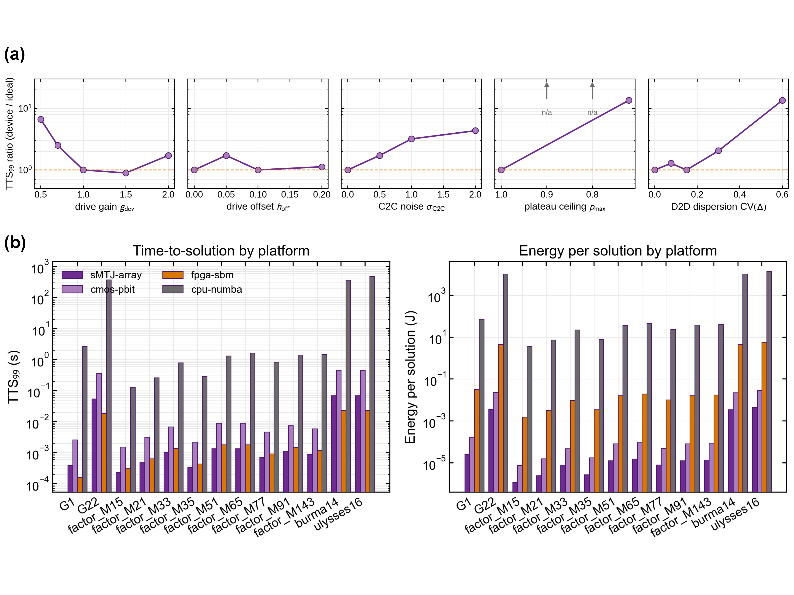

图3.8 器件级与跨硬件性能评估。(a) 14自旋ER Max-Cut测试实例上的器件非理想性单参数消融；(b) 四类平台的$\mathrm{TTS}_{99}$对比；(c) 四类平台的单解能耗对比。

五组扫描给出的灵敏度排序与电学存储的直觉部分相左，下面逐项来看。威胁最大的是Plateau ceiling ($p_\mathrm{max}$)：$p_\mathrm{max}=0.9$已使$\mathrm{TTS}_{99}$退化约$10\times$，$0.8$退化约$20\times$，$0.72$ (Device A AP→P高压平台实测值) 时$200$次试验无一命中基态，能量中位数自理想的$-6.77$依次坍缩至$-4.50$、$-3.55$、$-2.58$。这从仿真侧印证了2.3节的器件选型结论：back-hopping平台明显的样品不宜作概率单元，须经工艺筛选或工作点回退 (写入电压退至平台之前) 规避。次之的是Drive gain ($g_\mathrm{dev}$)：$g_\mathrm{dev}=0.5$退化$3.0\times$，而$g_\mathrm{dev}>1$反而加速 ($1.5$、$2.0$分别为$0.62\times$、$0.64\times$)，与同批次sigmoid斜率比Néel-Brown预测大$\eta_c\approx 5\sim 10$倍的实测一致，提示器件略高于理想drive gain的工作点有利于求解。Drive offset ($h_\mathrm{off}$) 在小偏置下尚可容忍 ($0.05$、$0.1$各为$1.4\times$、$1.8\times$)，但$h_\mathrm{off}=0.2$时急剧恶化至$40\times$、能量中位数降至$-6.44$：系统性偏置相当于一束与真实基态竞争的外场，退火越充分越被其俘获，故危害随扫数预算增长 (同一点在$T=500$下仅$6.9\times$)。C2C noise ($\sigma_\mathrm{C2C}$) 反而是最被容忍的一项，即便$\sigma_\mathrm{C2C}=2$也只带来$2.2\times$的退化，因为零均值抖动在多次重启下被平均抵消。D2D dispersion (CV$(\Delta)$) 在PDK基线$7.7\%$下仅$1.4\times$、推至$\mathrm{CV}=0.30$仍为$1.3\times$，但$\mathrm{CV}=0.60$时基线成功率被完全抹平；该容忍-至-崩溃形态与2.3.6节由Jensen不等式与Monte Carlo给出的$\mathcal{F}(\mathrm{CV}(\Delta))$传递函数同阶，PDK基线下$\mathcal{F}=0.997$对应的保持率在工程容差之内。

由此得到的灵敏度排序大致为：back-hopping平台$p_\mathrm{max}$最敏感 (即便$0.9$也退化$10\times$)，其次为大写入偏置$h_\mathrm{off}$与驱动增益亏损$g_\mathrm{dev}<1$；循环噪声$\sigma_\mathrm{C2C}$与中等以下的D2D离散CV$(\Delta)$则被较好容忍，仅在极端离散 ($\mathrm{CV}=0.6$) 下才崩溃。这一排序与存储MRAM的关注点既有重叠也有迁移：偏置对称性与阵列均匀性对二者皆重要，但作概率求解单元时循环噪声因多次重启被平均而高度容忍 (相对存储的实质放松)，主要约束转移到存储语境不强调的两项，即back-hopping平台抑制与drive gain标定。因此面向概率计算的sMTJ，其优化目标相比存储目标发生了重心迁移：在继续约束写入偏置与离散度的同时，把平台抑制与增益标定提到首位，这就为器件工艺优化与写入策略设计给出了明确的优先级。

把同一组扫描推广到$\mathrm{G1}$ ($n=800$、平均度$47.9$，G-set协议$T=10^4$、$(\beta_0,\beta_f)=(0.1,10)$、$N_\mathrm{trial}=200$，block更新、master seed 2024；该协议下理想基线$p_s=0.720$，与表3.2的$0.685$之差属种子与更新调度的统计涨落) 之后，排序的两端稳定而中段重排。稳定的两端是：$p_\mathrm{max}$仍最具破坏性，且在阵列规模下更甚——$0.9$即令$200$次试验无一命中 (14自旋实例上尚为$10\times$)，能量中位数自$-2036$坍缩至$-1171.5$；$\sigma_\mathrm{C2C}$、$h_\mathrm{off}$与$g_\mathrm{dev}$三者的退化则同落在$1.04\sim1.39\times$的窄带内、相互不可分辨，其中循环噪声不再单独占据最被容忍的位置 ($\sigma=2$为$1.04\times$，但该轴非单调，$\sigma=0.5$即达$1.35\times$)。重排出现在中段：D2D增益离散CV$(\Delta)$升为第二约束，$\mathrm{CV}=0.30$在$\mathrm{G1}$上产生统计可分辨的$1.66\times$退化 ($p_s$自$0.720$降至$0.535$，区间不重叠)，而在14自旋实例上仅$1.3\times$；写入偏置$h_\mathrm{off}$则相反，$0.2$在14自旋实例上的$40\times$灾难不复现，$\mathrm{G1}$上退化$1.25\times$且未达统计分辨 (该轴同样非单调，$h_\mathrm{off}=0.1$为$1.39\times$、区间$[1.07,1.81]$可分辨，故放松的是灾难性失效而非偏置约束本身)。机理在于$h_\mathrm{off}$是与$h_i$同量纲的绝对附加场，而典型$|h_i^\mathrm{eff}|$随连接度增长：随机构型下的中位$|h_i^\mathrm{eff}|$在14自旋实例上为$0.53$、在$\mathrm{G1}$上为$2.50$，同一绝对偏置占局部场的比例自$37\%$降至$8\%$。$g_\mathrm{dev}$两侧的效应同样弱化 ($0.5$与$1.5$在$\mathrm{G1}$上分别为$1.37\times$与$1.16\times$，后者不再加速)，故前段“略高于理想增益的工作点有利于求解”只在低连接度景观上成立。面向阵列的器件优先级据此收敛为：抑制back-hopping平台居首，其次是控制D2D增益离散CV$(\Delta)$；写入偏置与循环噪声在阵列规模下不再构成灾难性失效，但仍需控制在上述窄带内。

#### 3.4.3 跨硬件架构的TTS与能耗对比

要与已发表的Ising机横向对比，算法层的求解性能就得先翻译为物理时间与能耗。为此给四类代表性硬件各建一套物理模型，每个平台由单自旋更新时间$t_\mathrm{update}$、更新能量$e_\mathrm{update}$与并行度$N_\parallel$确定，参数与依据见表3.8。

表3.8 跨硬件架构投影参数

| 平台 | $t_\mathrm{update}$ | $e_\mathrm{update}$ | $N_\parallel$ | 数据源 |
|:---|:---:|:---:|:---:|:---|
| sMTJ-array (本工作) | $0.75\,\mathrm{ns}$ | $0.78\,\mathrm{pJ}$ | $64$ | 2.3节实测：$E=V_\mathrm{th}^2/R_\mathrm{SOT}\cdot t_w$ |
| CMOS p-bit ASIC | $5\,\mathrm{ns}$ | $5\,\mathrm{pJ}$ | $64$ | Camsari等2019[^Camsari2019]，本章代表性投影参数 |
| FPGA SBM | $1\,\mathrm{ns}$ | $1\,\mathrm{nJ}$ | $256$ | Goto等2021[^Goto2021] |
| CPU + Numba (软件) | runtime | runtime | $1$ | 仿真框架运行实测，TDP=$28\,\mathrm{W}$ |

CPU平台的参数由仿真框架的`time_median`实测数据在运行时反推 ($t_\mathrm{update}=\mathrm{time\_median}/(N_\mathrm{sweep}N_\mathrm{spin})$，能耗按单核TDP$=28\,\mathrm{W}$估算)，其量级与Intel x86单核芯片的功耗包络一致。CMOS p-bit参数取与文献p-bit实现相容的代表性ASIC量级，FPGA Ising机参数采用文献报道量级；每个$\mathrm{TTS}_{99}$与每解能耗依据
$$
\mathrm{TTS}_{99}=\frac{\log(1-0.99)}{\log(1-p_s)}\cdot N_\mathrm{sweep}\cdot\frac{N_\mathrm{spin}}{N_\parallel}\cdot t_\mathrm{update}
$$
$$
E_\mathrm{sol}=\frac{\log(1-0.99)}{\log(1-p_s)}\cdot N_\mathrm{sweep}\cdot N_\mathrm{spin}\cdot e_\mathrm{update}
$$
计算，其中$p_s$与$N_\mathrm{sweep}$取自前述基准的实测数据，与硬件物理参数解耦。投影只改变扫数到时间/能耗的换算系数、不改变算法层成功概率，故硬件比较结果跨平台可比。$N_\parallel=64$隐含的并行更新语义已经过数值验证：把64自旋固定块的同时更新与严格异步更新在同一种子协议下对照，$p_s$在置信区间内一致 ($\mathrm{G1}$为$0.690$对$0.685$，$N_\mathrm{trial}=200$；$\mathrm{G22}$为$0.003$对$0.004$，$N_\mathrm{trial}=2000$)，同时更新对耦合自旋细致平衡的破坏在该块宽下未产生可分辨的求解代价[^par-semantics]。

[^par-semantics]: 对照覆盖严格异步、贪心图着色的独立集类更新 (保持Gibbs正确性的并行方式) 与忽略邻接的固定64自旋块更新三种调度，退火调度、扫数与`SeedSequence`种子均与主基准一致。着色统计同时给出保正确性的并行宽度参照：$\mathrm{G1}$需19个色类、平均类宽$42$，$\mathrm{G22}$需12个色类、平均类宽$167$；后者说明对$\mathrm{G22}$这类中等连接度图，$N_\parallel=64$相对于着色调度反而保守。$\mathrm{G14}$在该扫数预算下三种调度的$p_s$均为零、对照不成立，故未列入。数据见仓库`eda/interface/parallel_semantics_summary.csv`。

将该模型作用于前节三类基准 (Max-Cut $\mathrm{G1}/\mathrm{G14}/\mathrm{G22}$、整数分解九个半素数目标、TSP $\mathtt{burma14}/\mathtt{ulysses16}$) 的实测$p_s$得到图3.8(b)与图3.8(c)。$\mathrm{G14}$因$p_s=0$在所有平台上$\mathrm{TTS}_{99}$均不定义，记为n/a；其余十三个实例上四类平台的相对位置稳定。

时间维度上，sMTJ-array显著快于CMOS p-bit与CPU。在$\mathrm{G22}$ ($n=2000$) 上sMTJ-array耗时$54.7\,\mathrm{ms}$、CMOS p-bit需$365\,\mathrm{ms}$ (约$6.7\times$)、FPGA SBM需$18.2\,\mathrm{ms}$ (约$0.33\times$，因$N_\parallel=256$的并行度优势)、CPU+Numba需$734\,\mathrm{s}$ (约$1.34\times 10^4\times$)。时间排序随规模而异：小规模实例 (整数分解，$N_{\text{spin}}\leq 15$) 上sMTJ-array最快，大规模实例 ($\mathrm{G1}$、$\mathrm{G22}$、TSP) 上FPGA SBM凭借$256\times$并行度领先；能耗维度上则sMTJ-array始终领先：$\mathrm{G22}$实例下sMTJ的每解能耗$3.6\,\mathrm{mJ}$显著低于CMOS的$22.8\,\mathrm{mJ}$ ($6.4\times$)、FPGA的$4.6\,\mathrm{J}$ (约$1280\times$)、CPU的$2.06\times 10^4\,\mathrm{J}$ (约$5.8\times 10^6\times$)。

硬件对比的主要差异来自更新操作的物理载体。sMTJ-array相对FPGA Ising机的优势不在原始时间，而集中于能耗效率：FPGA以GHz量级时钟在数字电路上模拟随机翻转动力学 (无论是Glauber采样还是simulated bifurcation的微分方程时间步进)，单次更新需通过LUT权重和、随机数生成、阈值比较的完整数字流水线，单次更新能耗在1 nJ量级、几乎完全由静态泄漏电流决定；sMTJ则以亚皮焦的单脉冲完成同等采样，能效提升$10^3\times$源自把"采样"这一操作从数字状态机迁移到本征随机器件层。相对CMOS p-bit ASIC，优势来自同尺度内的写入能耗压缩：两者皆在芯片层并行随机采样、$N_\parallel$同为$64$量级，差异源于sMTJ的SOT通道写入电压与脉宽相对CMOS LFSR或亚阈值MOS随机源的优势。该比较与已报道的sMTJ p-bit硬件实验的时间与能耗优势范围一致。

进一步与异类伊辛机架构的横向比较参见专题综述[^MohseniReview2022]。当前四类硬件中并未包含光学相干Ising机 (如NTT 100k-spin CIM)，后者在$N$扩展性上有相对优势，但其典型$\mathrm{TTS}_{99}$与本节sMTJ-array处于同一数量级，且能耗与光泵浦功率相关，不在本节物理模型的覆盖范围内。本节硬件对比的范围限于纳秒级更新时间、皮焦级更新能耗的电学Ising硬件。在该范围内，sMTJ-array同时给出了最低的求解能耗与可竞争的求解时间，其相对优势还随问题规模增大而放大。

#### 3.4.4 复现流水线

本节全部数据由两个驱动脚本复现。`bench_device_ablation.py`运行单参数消融，支持G-set模式 (需要外部数据文件) 与ER枚举模式 (无外部依赖，本节使用)，整次单参数消融实验在多核机器上约十分钟即可完成。`bench_hardware_compare.py`从任意基准驱动产生的`summary.csv`读入$p_s$与$N_\mathrm{sweep}$，按四类硬件物理参数计算$\mathrm{TTS}_{99}$与$E_\mathrm{sol}$并生成图像，运行时间可忽略。两个驱动均复用现有基准流水线，并与3.3节的`compare_baselines.py`、`bench_*.py`共享`SolverConfig`、`Problem`、`multistart`接口，可在无额外参数调整的情况下复用已生成的summary数据。

### 3.5 自旋更新链的电路级实现与开销评估

3.4节的跨硬件对比把每类平台抽象为$(t_\mathrm{update},e_\mathrm{update},N_\parallel)$三个标量，其中sMTJ阵列一行的$0.75\,\mathrm{ns}$与$0.78\,\mathrm{pJ}$由第二章器件公式反推，外围电路的时间与能耗贡献、以及器件非理想参数在真实电路中的具体形态均未经检验。本节在开源EDA流程内把单自旋更新链落实为晶体管级电路，给出电路方案与实测传输特性，把量化、钳位、复位可靠性与共享写线IR压降四项实测约束注入3.4.2节的消融框架，并以端到端的更新能量与时序修正3.4.3节的投影。全节以器件概率窗$V_T$为统一的规格参照：Gibbs驱动$u=2\beta h_i^\mathrm{eff}$对应写电压$V_\mathrm{wr}=V_\mathrm{th}+u\,V_T$，电路的每项精度指标均以$V_T$归一。

#### 3.5.1 更新链电路与实测传输特性

电路仿真采用与器件层同源的开源流程：sky130A工艺 (130 nm、1.8 V晶体管、tt corner) 承载全部CMOS外围，ngspice执行直流与瞬态求解，第二章标定的工作点模型 (Device A、P→AP、$t_w=0.75\,\mathrm{ns}$：$V_\mathrm{th}=0.896\,\mathrm{V}$、$V_T=23.4\,\mathrm{mV}$、$R_\mathrm{SOT}=776\,\Omega$、$R_\mathrm{P}=4.9\,\mathrm{k\Omega}$、$\mathrm{TMR}=1.0$) 经OpenVAF编译接入仿真器，写线电阻由Magic从KLayout生成的版图几何中提取。该模型的读支路是由状态节点控制的双态电阻，写支路是欧姆SOT沟道，工作点翻转概率以观测节点形式暴露；伯努利抽样与全部随机种子保留在Python测试台一侧，任何随机结果都可逐位重放。

脉冲写入型sMTJ的一次Gibbs更新由两类脉冲构成 (本节取自旋$s=+1$对应AP态)：复位脉冲先把器件置回P态即$s=-1$，概率写脉冲再以幅值$V_\mathrm{wr}=V_\mathrm{th}+u\,V_T$沿P→AP方向完成一次伯努利采样，该方向具有2.3节实测的干净单段sigmoid。这样一来，back-hopping平台只落在复位方向上：AP→P单脉冲成功率饱和于$r\approx0.72$，在脉冲间相互独立的假设下，连续$k$个复位脉冲后器件仍停留在AP态的残余概率为$0.28^k$，表现为向当前状态偏置的粘滞误差；该假设与相应的求解代价在3.5.2节标定与量化。

更新链电路如图3.9(a)。6-bit电阻串DAC跨接在$V_\mathrm{th}\pm4V_T$ (即$802.1\sim989.4\,\mathrm{mV}$) 的一对基准轨之间，选码传输门把码字对应的抽头送入两级Miller单位增益缓冲器，缓冲器经8指写使能传输门驱动器件的$776\,\Omega$写支路。约0.9 V的共模电平下，缓冲器输入对采用NMOS管；反馈自使能门之后的写节点取出，由环路增益修正使能门在约1.2 mA写电流下的压降。已发表的CMOS集成sMTJ p-bit驱动电路[^Cacoilo2026]同样由分压器与阈值级构成，但其可变阈值级以100 mV步进调节判决点，服务于自由振荡器件的数字化居中；以本文器件的概率窗衡量，该步进约合$4.3V_T$，单步即越过几乎整个概率过渡区。伊辛更新链要求单步跨越的翻转概率差小于整个过渡区，而非仅作状态判别的居中；本节链路取$0.13V_T$的步进以留出分辨裕度，3.5.2节将说明该裕度在阵列规模下可以让位于量程。

四种位宽下的直流传输特性汇总于表3.9，6-bit配置的逐码传输与器件报告的翻转概率见图3.9(b)。链路在全部位宽下单调，6-bit的LSB为3.08 mV ($0.13V_T$)、INL为0.85 LSB；绝对非线性来自缓冲器随输出电流变化的失调 (约2.8～3.1 mV，四种位宽相同)，因此以各自LSB归一的INL随位宽加深而增大。实测驱动窗口$u\in[-3.9,+4.4]$，对应可设定的翻转概率范围$[0.020,0.988]$。

表3.9 写链直流传输特性 (sky130 tt，原理图级实测)

| 位宽 | LSB (mV) | LSB$/V_T$ | 量程 (mV) | INL (LSB) | 单调 |
|:---:|:---:|:---:|:---:|:---:|:---:|
| 4 | $12.33$ | $0.53$ | $184.9$ | $0.20$ | 是 |
| 5 | $6.16$ | $0.26$ | $190.9$ | $0.42$ | 是 |
| 6 | $3.08$ | $0.13$ | $193.8$ | $0.85$ | 是 |
| 8 | $0.77$ | $0.033$ | $196.1$ | $3.45$ | 是 |

注：基准轨固定于$V_\mathrm{th}\pm4V_T$。INL按各位宽自身的LSB归一，其绝对值上界由缓冲器的码相关失调决定，与位宽无关。表中数值为tt角；五个工艺角 (tt/ss/ff/sf/fs) 下6-bit链路均保持单调，LSB在$2.98\sim4.22\,\mathrm{mV}$内，仅偏斜角sf的INL升至$9.3$ LSB、码相关失调达$18.0\,\mathrm{mV}$，见正文。

工艺角改变的是链路的模拟精度而非功能：五个角下单调性与读出判决均保持，tt/ss/ff/fs四角的LSB偏差在$\pm4\%$内。NMOS慢而PMOS快的sf角是例外，缓冲器工作点失衡使码相关失调升至18.0 mV ($0.77V_T$)、INL达9.3 LSB，相当于在概率映射上叠加一项随码字弯曲的确定性失真；它与写线IR压降同属确定性误差，可由一次性逐码校准吸收，构成版图前仿真给出的第一条角相关设计约束。

静态特性之外，脉冲工作暴露出直流扫描不可见的环路问题：写使能门斩波时反馈环在脉冲间隙开环，缓冲器输出被推至电源轨，器件在脉冲内承受约1.6 V，翻转概率被固定在1。最终电路以互补门控的复制支路构成电流舵，使缓冲器负载电流在脉冲内外保持恒定[^process-pulse-loop]。修正后的连续更新波形见图3.9(c)：写脉冲平顶与直流传输值的偏差为$+2.8\sim+5.8\,\mathrm{mV}$，残余源于0.75 ns平顶内尚未完全收敛的建立过程。

[^process-pulse-loop]: 过程记录：首版脉冲测试台直接以使能门斩波直流特性已验证的链路，缓冲器在脉冲间隙失去反馈，输出被推至电源轨，每个码字的翻转概率都被固定在1。曾尝试常通复制支路维持环路闭合，因输出级无法承受负载电流阶跃、平顶下垂87 mV而放弃；改为互补门控的电流舵后，缓冲器电源电流在脉冲内外恒定 (均为1.593 mA)，平顶偏差从约+650 mV收敛到+3～8 mV。

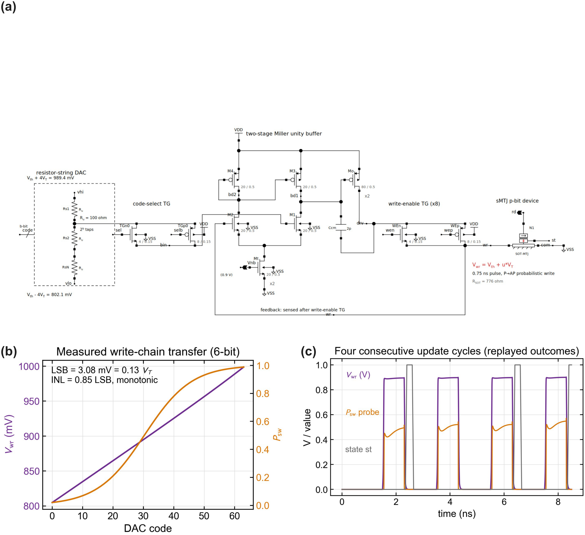

图3.9 sMTJ自旋更新链的电路实现与实测特性。(a) 更新链原理图 (sky130，Xschem导出)：电阻串DAC、选码传输门、NMOS输入两级Miller单位增益缓冲器与8指写使能传输门顺次驱动sMTJ的SOT写支路，反馈自使能门之后取出；(b) 6-bit链路的直流传输，左轴为各码字下实际送达的写电压，右轴为器件观测节点报告的翻转概率；(c) 连续四个更新周期 (周期2 ns、写脉冲0.75 ns) 的瞬态波形，纵轴为混合坐标 ($V_\mathrm{wr}$以伏特计，$P_\mathrm{sw}$观测与二值状态st为无量纲量)，自旋状态的随机结果由种子化测试台重放，而非SPICE噪声；(d) 五个工艺角下6-bit传输特性相对端点拟合直线的偏离，偏斜角sf的偏离达$-39.4\,\mathrm{mV}$ ($1.68V_T$)，其余四角不超过$4.2\,\mathrm{mV}$。

#### 3.5.2 位宽、量程与复位可靠性的算法回灌

电路约束对求解性能的影响沿用3.4.2节的协议度量：同一14自旋ER Max-Cut实例、$T=2000$、$(\beta_0,\beta_f)=(0.1,5.0)$、每点$N_\mathrm{trial}=200$次试验、相同master seed，报告相对理想Gibbs基线的$\mathrm{TTS}_{99}$倍数 (以扫数计)。量化与钳位以注册到求解器的电路后端实现：驱动$u$被钳位到基准轨窗口并吸附到码字网格，复位残余以粘滞项注入。图3.10给出该实例上的三条扫描曲线。规则的推广检验另取两组协议：五个ER种子$\times\,n\in\{14,20\}$ (每点$N_\mathrm{trial}=200$，跨种子比值取几何平均) 与G-set实例$\mathrm{G1}/\mathrm{G14}/\mathrm{G22}$ (沿用3.4.2节的G-set协议)。

基准轨量程是主导约束。固定6-bit位宽扫描轨半宽，$\pm2V_T$时退化$10.1\times$ ($p_s$从$0.185$跌至$0.020$)，$\pm4V_T$时$2.5\times$，$\pm6V_T$起在该实例上饱和于$1.3\times$。钳位截断的是退火末段的大驱动，过窄的概率窗口使本应冻结的自旋持续受热扰动，效果类似于对称化的$p_\mathrm{max}$上限。

该阈值并非常数，而随问题规模与连接度上移，这是把同一扫描推广到公共基准上才显现的[^process-span-scale]。五个ER种子的逐种子退化比几何均值上，$n$自$14$增至$20$时$\pm6V_T$即由$1.38\times$升至$1.59\times$，$\pm8V_T$才回到$1.1\times$量级；推进到G-set实例后阈值整体右移：$\mathrm{G1}$ ($n=800$、平均度$47.9$) 在$\pm6V_T$退化$63\times$、$\pm8V_T$仍$3.0\times$，$\pm10V_T$才回到$1.26\times$ ($p_s=0.635$对基线$0.720$)；$\mathrm{G22}$ ($n=2000$) 在$\pm8V_T$及以下$200$次试验零命中，$\pm10V_T$处也仅$1$次命中，该实例因而按能量中位口径读取：与理想的中位差自$\pm8V_T$的$6$个切分单位收窄到$\pm10V_T$的$1$个，命中数则不足以支撑$\mathrm{TTS}_{99}$比值 (点估计$3.0\times$、区间$[0,6.1]$跨$1$)。机制与阈值的移动方向一致：钳位把单次更新的确定性上限压在$\sigma(u_\mathrm{clip})$，退火末段依赖近确定性的更新维持已冻结的构型，而逆场翻转的期望次数随自旋数与扫数之积累积，可容许的单次错误概率因而随$N\cdot T$下降、所需窗口相应变宽，不是一个以$V_T$计的常数。落到电路上，$10^3$自旋量级、$10^4$扫数的阵列需要$\pm10V_T$以上的基准轨 (约$\pm234\,\mathrm{mV}$)，3.5.1节实现的$\pm4V_T$链路足以支撑小规模演示，用于阵列规模求解时量程偏窄。

[^process-span-scale]: 过程记录：$\pm6V_T$的门限最初取自14自旋实例的饱和点，并一度作为设计规则写入。把同一扫描推广到五个ER种子与三个G-set实例后，该门限被证伪：$\mathrm{G1}$在$\pm6V_T$的退化达$63\times$，比14自旋实例高出近两个数量级。据此把规则改写为随规模增长的形式，并把量程列为写DAC的首要设计参数。

位宽则不构成约束。固定轨下$4\sim8$ bit的退化比被钳位掩盖，五个ER种子的几何均值都停留在$2.9\sim3.3\times$ ($n=14$) 与$3.8\sim4.2\times$ ($n=20$)，档间差异远小于种子间差异；实测6-bit网格 (含INL与缓冲失调) 与同位宽理想网格在统计分辨内一致 ($2.05\times$对$2.45\times$，$p_s$差约$0.5\sigma$)，说明理想量化器足以描述该链路。把量程放宽到足以支撑$\mathrm{G1}$的$\pm10V_T$后，$4$、$6$、$8$ bit三档的$p_s$为$0.610$、$0.635$、$0.620$，Wilson区间几乎重合，即在量程合适时$4$ bit已够用。两项合并给出写DAC的设计取向：以分辨率换量程。$\pm10V_T$配$4$ bit的LSB为$1.33V_T$ (约$31\,\mathrm{mV}$)，单个码字跨越的翻转概率差已达$0.3$，求解性能相对理想基线却只差$1.35\times$；反过来，把LSB细分到$0.13V_T$而轨半宽只有$\pm4V_T$的链路在同一实例上完全无法求解。

$\beta$缩放轨下粗网格另有一种效应：若退火调度改由DAC基准轨随$\beta$缩放承载、码字在固定的$h$域网格上量化，则3 bit配置的$\mathrm{TTS}_{99}$仅为理想基线的$0.16\times$ ($p_s=0.73$，跨三个master seed复核稳定[^robust-note])。粗网格没有零码，幅值最小的档位把小局部场抬升数倍，等效于3.4.2节$g_\mathrm{dev}>1$的增益放大，在该实例的能量景观上加速收敛。该收益依赖景观结构，边界实验把适用范围定量化：在稀疏符号图$\mathrm{G14}$上，$h$域网格使能量中位数恶化$42\sim44$个切分单位 (3 bit) 与$36\sim37$个 (6 bit)，三个master seed一致；在受挫的$\pm1$三正则实例上3 bit退化$2.5\sim2.6\times$而6 bit与理想一致；在$M=65$整数分解上与理想无差异。受损景观的共性是小局部场承载排序信息，而不含零码的mid-rise网格恰好抹掉这部分信息。$\beta$缩放轨的结论因此收窄：在对小场不敏感的景观上它以$\geq4$ bit与理想基线统计等价、且概率分辨随退火进程保持恒定，在小场主导的稀疏符号景观上则须改用含零码的mid-tread编码，其实现与验证留待后续工作。

[^robust-note]: 三个master seed (2024、2025、4096) 下该配置$p_s$分别为$0.73$、$0.54$、$0.61$，理想基线为$0.185$、$0.21$、$0.13$；加速方向一致。

复位可靠性的代价远小于3.4.2节对称钳位所暗示的量级，其机制由四组对照分离。同为$0.72$的平台值以四种方式注入求解器：粘滞复位$k=1$退化仅$1.10\times$，且在另外两个master seed下与基线的差异落入统计涨落；把平台改作写脉冲自身的单向上限 ($p=\min(\sigma(u),0.72)$、反向不受影响) 退化$3.6\times$ (区间$[2.0,8.1]$)；两步方案中复位与写脉冲同时饱和退化$2.3\sim3.0\times$；3.4.2节的对称钳位则200次无一命中。四者的分野说明决定危害轻重的既不是方向的不对称、也不是两步结构本身，而是复位残余的作用形式：它只以概率$\rho$保持当前状态、从不钳位条件分布，低温段已冻结的构型不被持续拆毁。

复位脉冲数$k$的选择随规模与器件动力学双重收紧。规模上，$n=64$的ER实例上粘滞$k=1$退化$2.40\times$ (区间$[1.3,4.9]$)、按模型残余$0.28^k$取$k=3$即恢复到$1.57\times$ (区间$[0.9,2.8]$)，小实例上“$k=1$已可接受”的判断不能外推；在$\mathrm{G1}$上$k=1$与$k=3$分别为$1.20\times$与$1.07\times$，即高连接度景观对粘滞残余反而更宽容。器件动力学上，用第二章的宏自旋LLG引擎对连续复位脉冲做种子化标定 (1000条热场轨迹、0.75 ns脉冲)[^process-llg-seed]：单脉冲成功率$0.70$ (区间$[0.67,0.73]$) 复现实测平台，逐脉冲失败未见正相关 (独立假设在此意义下并不激进)，但已复位成功的器件在后续脉冲中以$14\%\sim21\%$的概率回跳 (back-hopping)，$k$个脉冲后的有效残余按$\{0.30,0.22,0.19,0.13\}$缓慢收敛而非$0.28^k$。把该有效残余注入求解器，$n=64$上$k=1\sim4$的退化为$2.09\times/1.75\times/1.50\times/1.25\times$，收益随$k$递减。工程结论由此修正：$k\approx2\sim3$在求解代价与每脉冲约1.24 pJ的能量间取得平衡，$n=64$量级阵列须接受约$1.5\sim1.8\times$的残余退化；把残余压到统计无害水平需要从器件侧抑制回跳 (工作点回退或筛选)，而非继续增加脉冲数。2.3节“平台样品不宜作概率单元”的器件筛选判据仍可放宽为工作方案约束，但放宽的幅度由回跳概率而非单脉冲成功率决定。实测6-bit网格与$k=3$的组合配置在14自旋实例上退化$1.36\times$，量化、钳位与复位三项约束叠加后的总代价不足$1.5\times$。

[^process-llg-seed]: 过程记录：LLG标定的双种子试点中发现全部“独立”轨迹逐位相同——`SeedSequence`子序列的`entropy`属性是父序列的熵、子身份存于`spawn_key`，经`int()`往返后丢失，若未在试点中发现，千条轨迹将是同一条的复制品。修正为直接传递子`SeedSequence`对象派生随机流，复跑试点确认轨迹互异后才展开千种子标定。

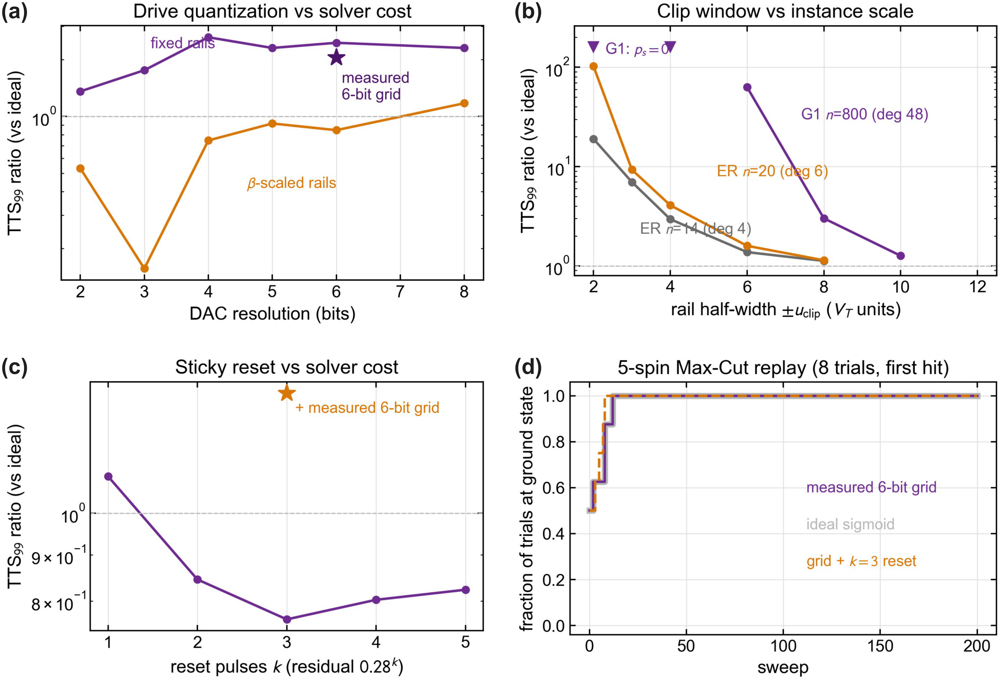

图3.10 写链实测约束回灌到3.4.2节消融框架的结果。(a) DAC位宽扫描：固定基准轨与$\beta$缩放基准轨两种退火实现下的$\mathrm{TTS}_{99}$退化比，星号为实测6-bit网格；(b) 钳位窗口随实例规模的移动：ER曲线为五个种子的几何均值，$\mathrm{G1}$为G-set协议单次运行，倒三角标记$p_s=0$的点；(c) 复位脉冲数$k$扫描，星号为实测网格与$k=3$的组合；(d) 5自旋Max-Cut重放中三种链路模型下首次命中基态的试验累积比例 (8次试验，同种子)；理想sigmoid与实测6-bit网格的曲线完全重合，前者以浅灰宽线衬底显示。

#### 3.5.3 共享写线IR压降与逐行预畸变

3.4.3节的投影假设$N_\parallel=64$个自旋并行更新，对应64×64阵列的列写线各承载一行的写电流。列线电阻使远端行的送达电压低于近端，形成逐行的静态驱动失调。写线几何 (met2、线宽1 µm、行距2 µm) 由KLayout生成、Magic提取：poly校准条带的extresist提取值47.96 Ω/□与工艺文件的48.2 Ω/□偏差为$-0.5\%$，证实提取流程无误；met2方块电阻0.125 Ω/□由提取的集总网络电阻读出[^process-extresist]。按提取的线电阻，$N=64$时远端行压降35.5 mV、折合驱动失调$1.52V_T$，恰落入3.4.2节$h_\mathrm{off}$消融急剧恶化的区间；$N=16$与$N=256$时分别为$0.39V_T$与$5.4V_T$ (图3.11(a))。

[^process-extresist]: 过程记录：met2条带的extresist流程最初不输出任何网表电阻 (提取8个网络、输出0个)，排查确认这源自该流程对低阻网络的筛选行为而非几何错误；最终以19 kΩ量级的poly条带完成流程校验，met2方块电阻改由extract do resistance写入.ext节点记录的集总电阻读出，两者对工艺文件的偏差分别为$-0.5\%$与0。

把$N=64$的失调剖面注入求解器 (14个自旋均匀分布于64行)，$p_s$从$0.185$跌至$0.065$、$\mathrm{TTS}_{99}$恶化$3.04\times$。补偿沿用写DAC本身：每行预置一个补偿码 ($N=64$最大需12个码、$N=256$需41个码，均在6-bit量程内)，残余失调不超过半个LSB即$0.066V_T$ (以本节$0.13V_T$的LSB计；若按3.5.2节以分辨率换量程，预畸变需另设细步进的偏置码路径)，回灌后退化比回到$1.06\times$，在200次试验的统计分辨内等于完全恢复 (图3.11(b))。既有电路资源即可消除IR压降带来的失调，它并不构成工艺限制，代价是每行一次校准写码。$N=256$以上的阵列则需要更宽的金属或分段驱动，属于版图层的后续工作。

#### 3.5.4 端到端更新开销与投影修正

一次更新的能量与时序由瞬态仿真逐项核算 (图3.11(c))。概率写脉冲中器件本身耗散0.81 pJ (与解析式$V^2t_w/R_\mathrm{SOT}$的0.78 pJ一致)，写使能门串联损耗0.24 pJ，缓冲器输出级0.60 pJ；复位脉冲按顶码幅值计为每个约1.24 pJ；StrongARM读出连同0.2 V读轨共0.12 pJ。真正主导端到端能量的是驱动静态功耗：A类缓冲器的静态电源功率为2.87 mW，摊到一次更新的12～16 ns (DAC重码建立9.0 ns，加$k+1$个脉冲与读出)，常开口径 (电源轨精确积分) 下每次更新34.6～46.1 pJ，功率门控口径下7.3～22.0 pJ ($k=1\sim5$)。以$k=3$的门控口径计，器件写能只占端到端能量的约5.5%，与3.4.3节以0.78 pJ充当$e_\mathrm{update}$的取值相差一个数量级以上：外围驱动的静态功耗与建立时间才是sMTJ伊辛阵列每次更新开销的最大来源。上述为tt角数值；五个工艺角下各项数值随角漂移，该结构不变：静态功率$2.67\sim3.11\,\mathrm{mW}$，建立时间$5.5\sim14.2\,\mathrm{ns}$ (ss最慢)，$k=3$门控口径能量$13.7\sim16.3\,\mathrm{pJ}$、更新周期$10.5\sim19.2\,\mathrm{ns}$，对应的投影修正系数在时间轴为$14\times\sim26\times$、能量轴为$17\times\sim21\times$ (tt为$18.7\times$)，器件写能占比在任一角均不超过6%。

把$k=3$门控口径的端到端参数 ($t_\mathrm{update}=14.0\,\mathrm{ns}$、$e_\mathrm{update}=14.7\,\mathrm{pJ}$) 代入3.4.3节的投影公式，sMTJ一行沿时间与能耗两轴各移约$18.7\times$ (图3.11(d))：G22实例上$\mathrm{TTS}_{99}$从54.7 ms升至1.02 s，每解能耗从3.6 mJ升至66.9 mJ，能耗上不再优于表3.8中CMOS p-bit的22.8 mJ，但仍显著低于FPGA SBM的4.6 J。该对比反映的是能量核算的口径边界，与平台优劣无关：表3.8中CMOS p-bit的文献参数同为单元级口径、未包含其驱动与读出外围，本节实测说明口径边界对能耗数字的影响 (此处约$19\times$) 大于表3.8中sMTJ与CMOS p-bit的平台间差异 (约$6\times$)，任何跨平台能耗结论都必须与口径边界一并陈述。器件级0.78 pJ的采样能量优势是真实的，它能否在阵列层兑现取决于驱动侧工程：功率门控 (本节已计入)、多列共享DAC与缓冲器、以开关型驱动替代A类缓冲器，是依次更深的改进方向。

时序上，0.75 ns的写脉冲只占更新周期的极小部分，缓冲器对DAC重码的9.0 ns建立时间主导$t_\mathrm{update}$。列间流水可以把建立时间移出关键路径、把有效更新周期压回脉冲量级，但它要求每列独立的DAC与缓冲器，与驱动共享的能量诉求方向相反：sMTJ伊辛阵列的外围设计在时间与能耗之间存在明确权衡，其定量刻画依赖具体阵列规模与调度，超出本节单元级评估的范围。复位脉冲数$k$的选择由能量-可靠性权衡给出：$\mathrm{TTS}_{99}(k)$在14自旋实例上$k\geq1$后即近似持平，而$e_\mathrm{update}(k)$随$k$线性增长；按3.5.2节$n=64$的标定，$k\approx2\sim3$是求解代价与脉冲能量的平衡点，相对$k=1$的能量代价为每次更新增加3.7～7.4 pJ (门控口径)。

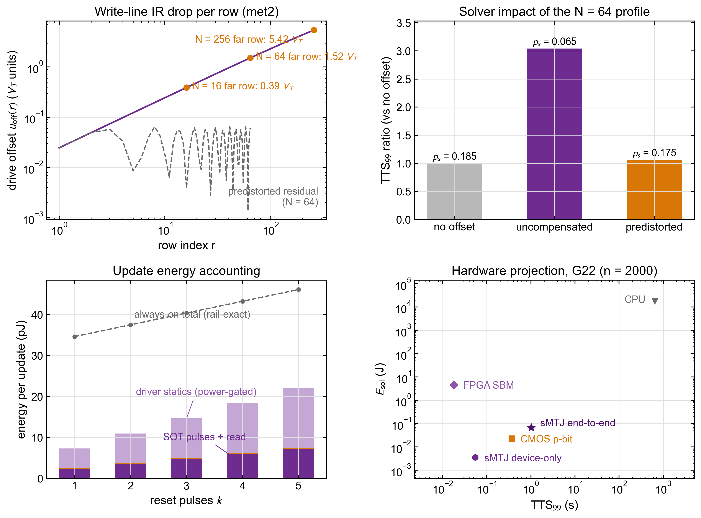

图3.11 写线IR压降、更新能量核算与投影修正。(a) met2列写线的逐行驱动失调 (以$V_T$归一，双对数坐标)，标出$N=16/64/256$远端行的失调值，虚线为$N=64$经6-bit逐行预畸变后的残余；(b) $N=64$失调剖面注入求解器前后的$\mathrm{TTS}_{99}$比值与成功概率；(c) 每次更新能量随复位脉冲数$k$的逐项分解 (功率门控口径的堆叠柱)，虚线为常开口径合计；(d) 以端到端参数 ($k=3$、门控口径) 修正后的G22硬件投影，sMTJ端到端点相对器件级点沿两轴各移约$18.7\times$。

#### 3.5.5 闭环重放与方法学口径

电路模型与算法层的一致性用3.2节的5自旋Max-Cut实例做端到端重放检验：同一实例、同一退火调度、同一组8个种子，把理想sigmoid、实测6-bit网格、实测网格加$k=3$复位三种链路模型依次代入更新规则。三种模型的8次试验全部命中基态，理想模型的能量轨迹与3.2节演示脚本的已提交输出逐位一致，实测网格模型的首次命中扫数与理想模型完全重合 (图3.10(d))。图3.9(c)的瞬态波形进一步核对了电路层的送达精度：重放的四个更新周期中，写脉冲平顶与直流传输值的偏差不超过5.8 mV ($0.25V_T$)。

本节结论的适用口径如下。全部CMOS数字为sky130原理图级仿真，主口径取tt角，五个工艺角的散布见表3.9注与3.5.4节，未含版图寄生 (写线电阻除外) 与失配统计；缓冲器与使能门取首轮可工作尺寸，未经速度或功耗优化，2.87 mW静态功率与9.0 ns建立时间 (tt角) 应视为该拓扑在此尺寸下的代表值而非极限；复位脉冲需要反极性驱动，以同幅值正极性脉冲的欧姆耗散作其能量代理，桥式驱动电路未实现；复位脉冲序列的统计已用宏自旋LLG标定 (见3.5.2节)，该标定属仿真而非实测、限于单一工作点，回跳概率对工作点的依赖未扫描；局部场$h_i^\mathrm{eff}$的数字求和电路未计入能量核算，该项在表3.8的sMTJ与CMOS p-bit行中同样缺席、两行之间口径一致，而FPGA行的nJ级能耗与CPU行的端到端实测已含权重求和，sMTJ相对这两行的能耗差距因此被相应低估。绝对数值受上述近似影响，以$V_T$归一的比值与各项排序则是可迁移的结论。本节全部数据由仓库`eda/`目录下的测试台脚本生成，每个数字对应一份带随机种子记录的结果文件，图3.9至图3.11可由`figs_make.py`直接重建。

### 3.6 本章小结

本章把全文主线下"同一硬件单元在组合优化任务上的可达性能与边界"这一问题，落到一个贯通问题、算法、器件与硬件四层的可控变量实验框架之上。前端以$(J,h)$承接各类组合优化问题；求解层共享异步Gibbs内核、几何退火与由`SeedSequence`派生的种子序列；器件层直接复用第二章所获得的五参数行为模型$(g_\mathrm{dev},h_\mathrm{off},\sigma_\mathrm{C2C},p_\mathrm{max},\mathrm{CV}(\Delta))$；硬件层则通过$(t_\mathrm{update},e_\mathrm{update},N_\parallel)$将不同平台投影为可比较的TTS与每解能耗。在这一框架中，sMTJ作为概率求解单元的作用可以从采样规则、退火参数、器件扰动与硬件实现四个层面分别加以检验，并追溯差异的来源。

算法层面的主要结论是，sMTJ-Gibbs与经典Metropolis-SA的单步规则差异对求解性能影响很小。在十四个跨结构、跨规模实例的同框架对照中，多数速比处于统计涨落内，$\mathrm{G1}$上SA保有小幅但显著的优势 (速比$0.84\times$，与单步翻转概率的Peskun排序方向一致)，$\mathrm{G22}$上初判的$3.71\times$加速经统计功效核查归于低命中数涨落。概率器件对伊辛求解的价值因此不在单步采样规则本身，而在于把$\sigma(2\beta h_i^\mathrm{eff})$的生成下沉到器件物理、免除数字化的接受概率求值与随机数接受判决，这一定位与器件层、硬件层的结论互为支撑。TSP基准给出了另一侧的边界：基础几何SA在$n^2$-spin QUBO上的失效并非退火参数标定不充分，因为惩罚系数$A$-margin在$1.2$至$10$的扫描范围内几乎不改变相对偏差；真正的瓶颈在于编码与更新粒度的耦合。将更新方式替换为置换空间簇翻转后，求解成功率即可跃迁至$p_s=1.00$，说明约束密集问题若要受益于sMTJ阵列，还需在单自旋抽象之外支持多p-bit的time-aligned更新。

器件与硬件分析标定了面向求解的非理想性优先级，且该优先级在14自旋实例与$n=800$的$\mathrm{G1}$上给出一致的两端：最敏感的始终是back-hopping平台$p_\mathrm{max}$ (阵列规模下$0.9$即令成功率归零)，而循环噪声$\sigma_\mathrm{C2C}$在两种规模上都处于最被容忍的一端。中段随连接度重排：D2D增益离散CV$(\Delta)$在$\mathrm{G1}$上升为第二约束，写入偏置$h_\mathrm{off}$的危害则相对减轻，因其是绝对附加场、相对于高连接度下增大的$|h_i^\mathrm{eff}|$只构成小扰动。面向概率计算的sMTJ优化目标体现为优先级重心迁移，而非存储目标的简单反转。跨硬件投影进一步表明，sMTJ-array在器件级能耗上的领先来自采样机制本身的物理迁移，即把随机更新从数字状态机下沉到本征随机器件层；3.5节的电路级核算同时指出，这一领先在阵列层的兑现程度由外围驱动的静态功耗与建立时间决定，驱动共享、功率门控与开关型驱动因此进入优化优先级的前列。电路级工作还给出了几项工程结论：更新链的代价由基准轨量程而非DAC分辨率决定，所需轨半宽随自旋数与扫数增长 ($10^3$自旋量级需$\pm10V_T$以上，而$4$ bit分辨率已够用；$\beta$缩放轨在小场主导的稀疏符号景观上仍是已定界的例外，见3.5.2节)，写DAC因此应以分辨率换量程；back-hopping平台经复位-写入两步方案降格为保持型粘滞残余，$k\approx2\sim3$个复位脉冲下64自旋量级阵列的代价约$1.5\sim1.8\times$，进一步压低残余须依靠器件侧对回跳的抑制；共享写线IR压降可被写DAC的逐行预畸变完全消除。这些结果可为器件筛选、工作点标定与系统选型提供优先级依据。

本章工作仍有若干局限。置换空间求解器虽然给出了TSP性能的可达上界，单自旋更新链也已在3.5节落实为晶体管级电路，但簇翻转所需的多p-bit time-aligned驱动仍无电路实现方案，电路评估的其余口径限制见3.5.5节。五参数行为模型主要刻画稳态非理想性，还没有覆盖累积写入退化与$1/f$低频漂移。此外，硬件投影的比较范围限于纳秒级、皮焦级的电学Ising硬件，光学相干Ising机和量子退火等异类平台尚未纳入。

从主线层面看，本章获得了两条独立于Max-Cut与TSP具体数字的证据，使第一章所提出的同一阵列承担两类任务的设想从设计构想推进为可证实的结论：其一，sMTJ阵列在器件级能耗维度的领先来自把采样下沉至本征随机器件层这一范式差异，而非具体电路优化的累积，其在阵列层的兑现幅度则由驱动侧外围工程决定；其二，求解性能的灵敏度优先级与传统存储MRAM不尽相同，平台抑制居首、阵列级增益离散的控制在阵列规模下升为其次，而写入偏置、增益标定与循环噪声的要求相对放松，因此面向概率计算的sMTJ工艺路线图与面向存储的路线图在优化重心上有所迁移。二者共同构成对全自旋三位一体架构在伊辛求解任务上的工程化判断。下一章将把同一硬件单元转作PBNN的伯努利权重，复用本章所建立的器件级Sigmoid接口、硬件投影方法与sky130电路评估流程，考察相同架构在机器学习推断任务上的对偶定位。


### 参考文献

[^Barahona1982]: Barahona F. On the computational complexity of Ising spin glass models[J]. Journal of Physics A: Mathematical and General, 1982, 15(10): 3241-3253. DOI: [10.1088/0305-4470/15/10/028](https://doi.org/10.1088/0305-4470/15/10/028).

[^Kirkpatrick1983]: Kirkpatrick S, Gelatt C D, Vecchi M P. Optimization by simulated annealing[J]. Science, 1983, 220(4598): 671-680. DOI: [10.1126/science.220.4598.671](https://doi.org/10.1126/science.220.4598.671).

[^Hajek1988]: Hajek B. Cooling schedules for optimal annealing[J]. Mathematics of Operations Research, 1988, 13(2): 311-329. DOI: [10.1287/moor.13.2.311](https://doi.org/10.1287/moor.13.2.311).

[^Kochenberger2014]: Kochenberger G, Hao J K, Glover F, et al. The unconstrained binary quadratic programming problem: a survey[J]. Journal of Combinatorial Optimization, 2014, 28(1): 58-81. DOI: [10.1007/s10878-014-9734-0](https://doi.org/10.1007/s10878-014-9734-0).

[^Karp1972]: Karp R M. Reducibility among combinatorial problems[M]//Miller R E, Thatcher J W, Bohlinger J D, eds. Complexity of Computer Computations. Boston, MA: Springer, 1972: 85-103. DOI: [10.1007/978-1-4684-2001-2_9](https://doi.org/10.1007/978-1-4684-2001-2_9).

[^Goemans1995]: Goemans M X, Williamson D P. Improved approximation algorithms for maximum cut and satisfiability problems using semidefinite programming[J]. Journal of the ACM, 1995, 42(6): 1115-1145. DOI: [10.1145/227683.227684](https://doi.org/10.1145/227683.227684).

[^Lucas2014]: Lucas A. Ising formulations of many NP problems[J]. Frontiers in Physics, 2014, 2: 5. DOI: [10.3389/fphy.2014.00005](https://doi.org/10.3389/fphy.2014.00005).

[^Jiang2018]: Jiang S, Britt K A, McCaskey A J, et al. Quantum annealing for prime factorization[J]. Scientific Reports, 2018, 8: 17667. DOI: [10.1038/s41598-018-36058-z](https://doi.org/10.1038/s41598-018-36058-z).

[^Borders2019]: Borders W A, Pervaiz A Z, Fukami S, et al. Integer factorization using stochastic magnetic tunnel junctions[J]. Nature, 2019, 573(7774): 390-393. DOI: [10.1038/s41586-019-1557-9](https://doi.org/10.1038/s41586-019-1557-9).

[^Gset]: Ye Y. G-set benchmark instances for Max-Cut[DB/OL]. Stanford University. [G-set data page](https://web.stanford.edu/~yyye/yyye/Gset/).

[^BenlicHao2013]: Benlic U, Hao J K. Breakout local search for the Max-Cut problem[J]. Engineering Applications of Artificial Intelligence, 2013, 26(3): 1162-1173. DOI: [10.1016/j.engappai.2012.09.001](https://doi.org/10.1016/j.engappai.2012.09.001).

[^Onizawa2024]: Onizawa N, Hanyu T. Enhanced convergence in p-bit based simulated annealing with partial deactivation for large-scale combinatorial optimization problems[J]. Scientific Reports, 2024, 14: 1339. DOI: [10.1038/s41598-024-51639-x](https://doi.org/10.1038/s41598-024-51639-x).

[^Aadit2022]: Aadit N A, Grimaldi A, Carpentieri M, et al. Massively parallel probabilistic computing with sparse Ising machines[J]. Nature Electronics, 2022, 5(7): 460-468. DOI: [10.1038/s41928-022-00774-2](https://doi.org/10.1038/s41928-022-00774-2).

[^Reinelt1991]: Reinelt G. TSPLIB: a traveling salesman problem library[J]. ORSA Journal on Computing, 1991, 3(4): 376-384. DOI: [10.1287/ijoc.3.4.376](https://doi.org/10.1287/ijoc.3.4.376).

[^Warren2021]: Warren R H. Solving combinatorial problems by two D-Wave hybrid solvers: a case study of traveling salesman problems in the TSP Library[EB/OL]. arXiv:2106.05948, 2021. DOI: [10.48550/arXiv.2106.05948](https://doi.org/10.48550/arXiv.2106.05948).

[^Aramon2019]: Aramon M, Rosenberg G, Valiante E, et al. Physics-inspired optimization for quadratic unconstrained problems using a digital annealer[J]. Frontiers in Physics, 2019, 7: 48. DOI: [10.3389/fphy.2019.00048](https://doi.org/10.3389/fphy.2019.00048).

[^Camsari2019]: Camsari K Y, Sutton B M, Datta S. p-bits for probabilistic spin logic[J]. Applied Physics Reviews, 2019, 6(1): 011305. DOI: [10.1063/1.5055860](https://doi.org/10.1063/1.5055860).

[^Goto2021]: Goto H, Endo K, Suzuki M, et al. High-performance combinatorial optimization based on classical mechanics[J]. Science Advances, 2021, 7(6): eabe7953. DOI: [10.1126/sciadv.abe7953](https://doi.org/10.1126/sciadv.abe7953).

[^MohseniReview2022]: Mohseni N, McMahon P L, Byrnes T. Ising machines as hardware solvers of combinatorial optimization problems[J]. Nature Reviews Physics, 2022, 4(6): 363-379. DOI: [10.1038/s42254-022-00440-8](https://doi.org/10.1038/s42254-022-00440-8).

[^Cacoilo2026]: Cacoilo N, Yoon J, Madhavan A, et al. 130-nm CMOS-integrated superparamagnetic tunnel junction-based p-bit[J]. IEEE Electron Device Letters, 2026, 47(7). DOI: [10.1109/LED.2026.3696800](https://doi.org/10.1109/LED.2026.3696800).

[^Peskun1973]: Peskun P H. Optimum Monte-Carlo sampling using Markov chains[J]. Biometrika, 1973, 60(3): 607-612. DOI: [10.1093/biomet/60.3.607](https://doi.org/10.1093/biomet/60.3.607).
